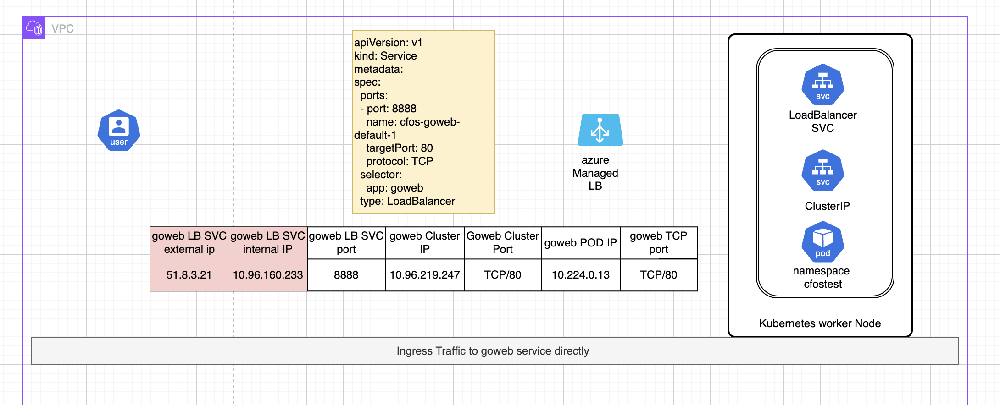
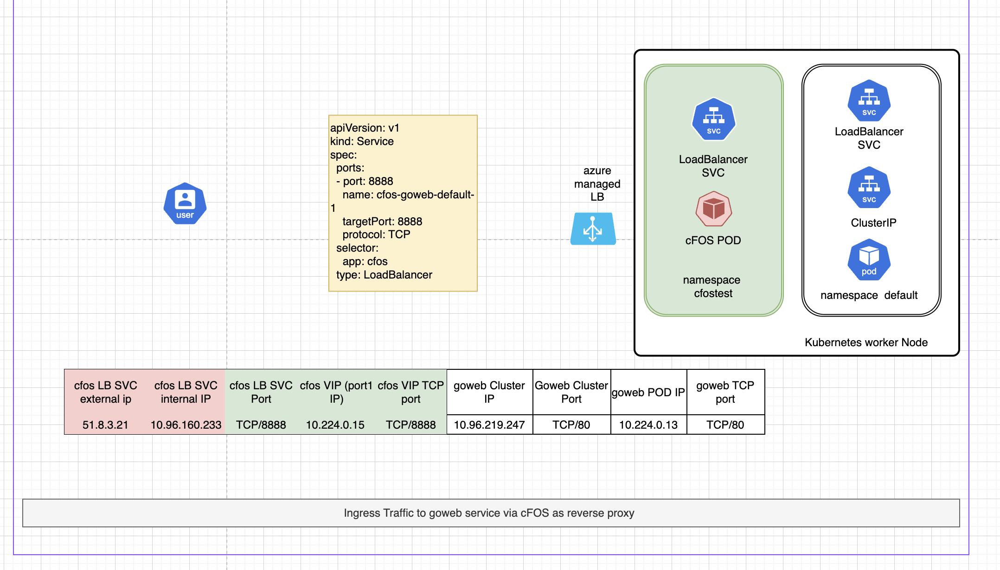

### Purpose

In this chapter, we going to setup a end to end demo to secure traffic from internet to application deployed in aks cluster. we will use aks loadBalancer SVC to create loadbalancer svc to backend application.

**traffic diagram without use cFOS**



**traffic diagram after use cFOS in the middle**

with cFOS in the middle, it function as a reverse proxy. 


### Clone script from github

```bash
cd $HOME
git clone https://github.com/FortinetCloudCSE/k8s-201-workshop.git
cd $HOME/k8s-201-workshop
git pull
cd $HOME
```
### Continue from K8S 101 workshop

if you are continue from k8s-101 session, you shall already have k8s installed. 

**setup some variable** 
```bash
kubectl get node
owner="tecworkshop"
alias k="kubectl"
currentUser=$(az account show --query user.name -o tsv)
resourceGroupName=$(az group list --query "[?contains(name, '$(whoami)') && contains(name, 'workshop')].name" -o tsv)
location=$(az group show --name $resourceGroupName --query location -o tsv)
scriptDir="$HOME"
svcname=$(whoami)-$owner
cfosimage="fortinetwandy.azurecr.io/cfos:255"
cfosnamespace="cfostest"
```
The k8s from ks8-101 might not have metallb installed, if so, install it. 

**install metallb**
```bash
kubectl apply -f https://raw.githubusercontent.com/metallb/metallb/v0.14.3/config/manifests/metallb-native.yaml
kubectl rollout status deployment controller -n metallb-system

local_ip=$(kubectl get node -o wide | grep 'control-plane' | awk '{print $6}')
cat <<EOF | tee metallbippool.yaml
apiVersion: metallb.io/v1beta1
kind: IPAddressPool
metadata:
  name: first-pool
  namespace: metallb-system
spec:
  addresses:
  - $local_ip/32
---
apiVersion: metallb.io/v1beta1
kind: L2Advertisement
metadata:
  name: example
  namespace: metallb-system
EOF
kubectl apply -f metallbippool.yaml 
```

### Create Self-managed k8s

This task is going take around 10 minutes. 

```bash
scriptDir="$HOME"
cd $HOME/k8s-201-workshop/scripts/cfos/egress
./create_kubeadm_k8s_on_ubuntu22.sh
cd $scriptDir
svcname=$(kubectl config view -o json | jq .clusters[0].cluster.server | cut -d "." -f 1 | cut -d "/" -f 3)
echo $svcname
```

### or Create aks cluster 
create aks cluster 

{}
append "--enable-node-public-ip" if you want assign a public ip to worker node" ,without public-ip for worker node, container will not able to use ping to reach internet
{}

```bash
#!/bin/bash -x
owner="tecworkshop"
alias k="kubectl"
currentUser=$(az account show --query user.name -o tsv)
#resourceGroupName=$(az group list --query "[?tags.UserPrincipalName=='$currentUser'].name" -o tsv)
resourceGroupName=$(az group list --query "[?contains(name, '$(whoami)') && contains(name, 'workshop')].name" -o tsv)
location=$(az group show --name $resourceGroupName --query location -o tsv)
scriptDir="$HOME"
svcname=$(whoami)-$owner
cfosimage="fortinetwandy.azurecr.io/cfos:255"
cfosnamespace="cfostest"
echo "Using resource group $resourceGroupName in location $location"

cat << EOF | tee > $HOME/variable.sh
#!/bin/bash -x
alias k="kubectl"
scriptDir="$HOME"
aksVnetName="AKS-VNET"
aksClusterName=$(whoami)-aks-cluster
rsakeyname="id_rsa_tecworkshop"
remoteResourceGroup="MC"_${resourceGroupName}_$(whoami)-aks-cluster_${location} 
EOF
echo location=$location >> $HOME/variable.sh
echo owner=$owner >> $HOME/variable.sh
echo resourceGroupName=$resourceGroupName >> $HOME/variable.sh
echo cfosimage=$cfosimage >> $HOME/variable.sh
echo scriptDir=$scriptDir >> $HOME/variable.sh
echo cfosnamespace=$cfosnamespace >> $HOME/variable.sh

chmod +x $HOME/variable.sh
line='if [ -f "$HOME/variable.sh" ]; then source $HOME/variable.sh ; fi'
grep -qxF "$line" ~/.bashrc || echo "$line" >> ~/.bashrc
source $HOME/variable.sh
$HOME/variable.sh

az network vnet create -g $resourceGroupName  --name  $aksVnetName --location $location  --subnet-name aksSubnet --subnet-prefix 10.224.0.0/24 --address-prefix 10.224.0.0/16

aksSubnetId=$(az network vnet subnet show \
  --resource-group $resourceGroupName \
  --vnet-name $aksVnetName \
  --name aksSubnet \
  --query id -o tsv)
echo $aksSubnetId


[ ! -f ~/.ssh/$rsakeyname ] && ssh-keygen -t rsa -b 4096 -q -N "" -f ~/.ssh/$rsakeyname

az aks create \
    --name ${aksClusterName} \
    --node-count 1 \
    --vm-set-type VirtualMachineScaleSets \
    --network-plugin azure \
    --location $location \
    --service-cidr  10.96.0.0/16 \
    --dns-service-ip 10.96.0.10 \
    --nodepool-name worker \
    --resource-group $resourceGroupName \
    --kubernetes-version 1.28.9 \
    --vnet-subnet-id $aksSubnetId \
    --ssh-key-value ~/.ssh/${rsakeyname}.pub
az aks get-credentials -g  $resourceGroupName -n ${aksClusterName} --overwrite-existing


```
### create image pull secret for k8s 
use below script to create imagepullsecret, replace acessToken below with real token 
```bash
loginServer="fortinetwandy.azurecr.io"
accessToken="eyJhbGciOiJSUzI1NiIsInR5cCI6IkpXVCIsImtpZCI6IklFTVI6TTdFRzpVV1JUOllIUEs6T1BZUTpZQjZNOjVUQ1M6S1RYRjpaQUhDOlZIRUw6RVVMUTo0SU1LIn0.eyJqdGkiOiIzMmZkYWY5ZS04ZTFlLTRhODUtYmQ0My02NjBiYWI4NDM0YjIiLCJzdWIiOiJ3YW5keUBmb3J0aW5ldC11cy5jb20iLCJuYmYiOjE3MTk0NjY4MDgsImV4cCI6MTcxOTQ3ODUwOCwiaWF0IjoxNzE5NDY2ODA4LCJpc3MiOiJBenVyZSBDb250YWluZXIgUmVnaXN0cnkiLCJhdWQiOiJmb3J0aW5ldHdhbmR5LmF6dXJlY3IuaW8iLCJ2ZXJzaW9uIjoiMS4wIiwicmlkIjoiMzkzYzEzYTJlNjE4NDk4ZDk0NDliMWUyZjRmMmUzMGQiLCJncmFudF90eXBlIjoicmVmcmVzaF90b2tlbiIsImFwcGlkIjoiMDRiMDc3OTUtOGRkYi00NjFhLWJiZWUtMDJmOWUxYmY3YjQ2IiwidGVuYW50IjoiOTQyYjgwY2QtMWIxNC00MmExLThkY2YtNGIyMWRlY2U2MWJhIiwicGVybWlzc2lvbnMiOnsiYWN0aW9ucyI6WyJyZWFkIiwid3JpdGUiLCJkZWxldGUiLCJtZXRhZGF0YS9yZWFkIiwibWV0YWRhdGEvd3JpdGUiLCJkZWxldGVkL3JlYWQiLCJkZWxldGVkL3Jlc3RvcmUvYWN0aW9uIl19LCJyb2xlcyI6W119.cibhsDcRt0Jw9L55u66sLByl1blVxlzGIGC_rJxiDWFsjcIzjLHVYriGXgRBT5TE1pqxyJ4dSV35X9ADEbpAIA8rwSdlNyAQIL0DQ58DFz5MjG8FvTjdu3A2xfW4wdIF9n-jPONp9hZWXixXbsU5BNgbAUxcs_thXetjBrxqFHuRQuUqPm08ScaI2kZFPAVe3jzLm4a4vMZJyC70H2hO16poei4ac6AK1Ho1JcKzPHPa8K6e9HT4LcXT6NI7RibkkVwEd5zipE46xT7VZgICFtgFKd0IvYEQsPY4CfB8KeYp4qXXBUZq6TLBYkbEcvTo5XnVWcwOizg2tIQrHHT1OA"
echo $accessToken
echo $loginServer 
kubectl create namespace $cfosnamespace
kubectl create secret -n $cfosnamespace docker-registry cfosimagepullsecret \
    --docker-server=$loginServer \
    --docker-username=00000000-0000-0000-0000-000000000000 \
    --docker-password=$accessToken \
    --docker-email=wandy@fortinet.com
```


### Create cFOS configmap license 
upload you license via azue shell Manag files feature  to upload your cFOS license file. 
do not change or modify license file. 


assume you have downloaded cFOS license file and alread uploaded to your azure cloud shell. the cFOS license file has name "CFOSVLTM24000016.lic".  without need modify any content for your cFOS license. use below script to create a configmap file for cFOS license. once cFOS POD up , it will automatically get the configmap to apply the license. 

```bash
cd $HOME
$scriptDir/k8s-201-workshop/scripts/cfos/generatecfoslicensefromvmlicense.sh CFOSVLTM24000016.lic
kubectl apply -f cfos_license.yaml -n $cfosnamespace
```

### Quick Demo

With cFOS license and cFOS image pull secret ready, we are ready to do a quick demo. 
in this demo, we will create a loadBalancer svc for backend web application, then we deploy a cfos controller, this cfos controller will deploy a cFOS and then create a reverse proxy with VIP on CFOS to pretect http traffic ingress to this web application, the cFOS configuration will be done by cFOS controller automatically, in Chapter 6, you will do same but without rely on cFOS controller. 


**create cfos controller** 
{}
please be aware the cfos controller is only for demo purpose, this is NOT A PRODUCT from fortinet. it is build for this demo only. 
{}

the cfos controller use below preconfigred variable 
```
  cfosContainerImage: "fortinetwandy.azurecr.io/cfos:255"
  cfosImagePullSecret: "cfosimagepullsecret"
  managedByController: "fortinetcfos"
  cfosNameSpace: "cfostest"
```
if you use different cfosContainerImage repo or namespace etc, make sure modify 04_deploy_cfos_controller.yaml to match with actual variable before deploy cfoscontroller.

```bash
cd $HOME
kubectl  apply -f $scriptDir/k8s-201-workshop/scripts/cfos/04_deploy_cfos_controller.yaml
```
**create backend application and clusterip SVC**
```bash
kubectl create deployment goweb --image=interbeing/myfmg:fileuploadserverx86
kubectl expose  deployment goweb --target-port=80  --port=80
```
**create loadBalancer SVC** 

Below yaml file will create a loadbalancer SVC, this service will exposed TCP port 8888 to internet via azure LB,the target endpoint will be cfos container on tcp port 8888 based on selector **app: cfos** and **targetPort** field in spec , then cFOS controller will config CFOS with cFOS POD IP + 8888 as VIP and map to actual application goweb clusterIP+tcp port 80. goweb application can in any namespace like belew use namespace default. 

The traffic path will be 
client(1)---Internet--azure LB public IP/DNS(2) ---cFOS VIP+PORT(3) ---goweb cluster ip:port(4) --goweb POD IP:PORT(5)

- (1) client can be azure cloud shell or your laptop browser 
- (2) DNS name will be $svcname.$location.cloudapp.azure.com
- (3) cFOS port1 IP + VIP PORT 8888
- (4) goweb cluster ip for example 10.96.240.247:80 
- (5) goweb POD IP + PORT for example 10.224.0.19:80

```bash
cd $HOME
svcname=$(kubectl config view -o json | jq .clusters[0].cluster.server | cut -d "." -f 1 | cut -d "/" -f 3)
cat << EOF | tee > 03_single.yaml 
apiVersion: v1
kind: Service
metadata:
  name: cfos7210250-service
  annotations:
    managedByController: fortinetcfos
    metallb.universe.tf/loadBalancerIPs: 10.0.0.4
    service.beta.kubernetes.io/azure-dns-label-name: $svcname
spec:
  sessionAffinity: ClientIP
  ports:
  - port: 8888
    name: cfos-goweb-default-1
    targetPort: 8888
    protocol: TCP
  selector:
    app: cfos
  type: LoadBalancer

EOF
kubectl apply -f 03_single.yaml  -n $cfosnamespace
kubectl rollout status deployment cfos7210250-deployment -n $cfosnamespace
sleep 5
kubectl get svc cfos7210250-service  -n $cfosnamespace 
```

### Verify Result
```

curl http://$svcname.$location.cloudapp.azure.com:8888

```
you shall see output 
```
<html><body><form enctype="multipart/form-data" action="/upload" method="post">
<input type="file" name="myFile" />
<input type="submit" value="Upload" />
```

### Clean up 
```bash
cd $HOME
kubectl delete namespace $cfosnamespace
kubectl delete -f $scriptDir/k8s-201-workshop/scripts/cfos/04_deploy_cfos_controller.yaml
kubectl delete sa sa-cfoscontrolleramd64alpha16
kubectl delete deployment goweb
kubectl delete svc goweb
#az aks delete --name ${aksClusterName} -g ${resourceGroupName}
```
### Q&A

**Question**
What is the benefit of using cFOS to pretect ingress traffic compare with use Fortigate OS VM or appliance ?


**Answer**

- K8s Native 

with cFOS controller, end-user even does not require any knowledge of network or fortios cli. end-user only require create or modify existing loadBalancer SVC yaml file and deploy them use kubectl. that's ALL.


- secure POD to POD traffic and VM to POD traffic.
FortiGate VM/appliance can not protect traffic within VNET if Fortigate deployed outside of VNET.
but with cFOS, you can easiy secure traffic between POD to POD and VM to POD without introduce other component. 

