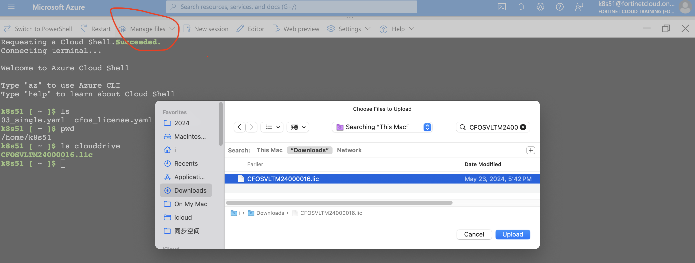

In this chapter, we will:

- Clone the scripts from GitHub
- Create a cFOS image pull Secret
- Create a cFOS license ConfigMap
- Deploy cFOS using a Deployment
- Config cFOS with cli command

If you are not familiar with Kubernetes Secrets and ConfigMaps, refer to [ConfigMap and Secret in cFOS](/05configmapsecrets/task4_2_creating_managing_configmaps_secrets.html) for more details.

When deploying cFOS, concepts such as Role and ClusterRole will be required. To better understand RBAC, Role, and ClusterRole, refer to [K8s Role](/03roles.html) and [RoleBinding](/04rolebindings.html)

For more information about cFOS, check the [cFOS overview](/07ingresstraffic/task7_1_overview-of-ingress-in-kubernetes.html#cfos-overview) and [cFOS role in K8s](/02k8ssecurity/task1_1_introduction_to_kubernetes_security.html#preventionprotection-via-network-security-1).

### Create namespae 

```bash
cfosnamespace="cfostest"
kubectl create namespace $cfosnamespace
```

### Create Image Pull Secret for Kubernetes

Use the script below to create a Kubernetes secret for pulling the cFOS image from **Azure Container Registry (ACR)**. You will need an access token from ACR to create the secret. 

{}
If you have your own cFOS image hosted on another registry, you can use that. Just ensure that the **secret** is named "cfosimagepullsecret".
{}

Get your ACR access token and test it


{}

Paste your ACR Username it into the variable `UserName` using the command below:
```bash
loginServer="fortinetwandy.azurecr.io"

read -p "Paste your UserName for acr server $loginServer:|  " userName
echo $userName
```
{}

{}

Paste your ACR token it into the variable `accessToken` using the command below:
```bash

read -p "Paste your accessToken for acr server $loginServer:|  " accessToken
echo $accessToken
```
{}
{}
```bash
docker login $loginServer -u $userName -p $accessToken
```
{}
{}
```TableGen
WARNING! Using --password via the CLI is insecure. Use --password-stdin.
Login Succeeded
```
{}


Create k8s secret with accessToken and save a copy of yaml file for later use.


{}
```bash
filename="cfosimagepullsecret.yaml"
echo $accessToken
echo $loginServer 
kubectl create namespace $cfosnamespace
kubectl create secret -n $cfosnamespace docker-registry cfosimagepullsecret \
    --docker-server=$loginServer \
    --docker-username=$userName \
    --docker-password=$accessToken \
    --docker-email=wandy@example.com
kubectl get secret cfosimagepullsecret -n $cfosnamespace -o yaml | tee $filename
sed -i '/namespace:/d' $filename
```
{}
{}
```bash
kubectl get secret -n $cfosnamespace
```
{}
{}
```TableGen
NAME                  TYPE                             DATA   AGE
cfosimagepullsecret   kubernetes.io/dockerconfigjson   1      38m
```

you can also verify the username and password for acr from your secret object 

{}



```bash
kubectl get secret -n $cfosnamespace cfosimagepullsecret -o jsonpath="{.data.\.dockerconfigjson}" | base64 --decode | jq -r '.auths."fortinetwandy.azurecr.io".auth' | base64 --decode
```
### Create cFOS configmap license 

cFOS requires a license to be functional. Once your license is activated, download the license file and then upload it to Azure Cloud Shell. 

**Important:** Do not change or modify the license file.




- After upload, your **.lic** license file will be located in **$HOME**
- replace your **.lic** license file name in the script below to create a ConfigMap for the cFOS license
- Once the cFOS container boots up, it will automatically retrieve the ConfigMap to apply the license.


{}
Paste your license filename to use it in configmap
```bash

read -p "Paste your cFOS License Filename:|  " licFilename
echo $
```
{}
{}
```bash
cd $HOME
cfoslicfilename=$licFilename
[ ! -f $cfoslicfilename ] && read -p "Input your cfos license file name :|  " cfoslicfilename
$scriptDir/k8s-201-workshop/scripts/cfos/generatecfoslicensefromvmlicense.sh $cfoslicfilename
kubectl apply -f cfos_license.yaml -n $cfosnamespace
```
{}
{}

{}
You should see the following result: 


```commandline
cfos_license.yaml created.
configmap/fos-license created
```

{}


```sh
echo get your cFOS license file ready.
cat <<EOF | tee cfos_license.yaml
apiVersion: v1
kind: ConfigMap
metadata:
    name: fos-license
    labels:
        app: fos
        category: license
data:
    license: |+
EOF
cd $HOME
cfoslicfilename="<<INSERT YOUR .LIC FILENAME HERE>>"
[ ! -f $cfoslicfilename ] && read -p "Input your cfos license file name :|  " cfoslicfilename
while read -r line; do printf "      %s\n" "$line"; done < $cfoslicfilename >> cfos_license.yaml
kubectl create -f cfos_license.yaml -n $cfosnamespace
```

{}

{}
{}


**check license configmap**


{}
Use following command to check whether license is correct
```
kubectl get cm fos-license -o yaml -n $cfosnamespace
 ```
{}
{}
```bash
diff -s -b <(k get cm fos-license -n $cfosnamespace -o jsonpath='{.data}' | jq -r .license |  sed '${/^$/d}' ) $cfoslicfilename
```
{}
{}
```commandline
Files /dev/fd/63 and CFOSVLTMxxxxxx.lic are identical
```
{}


### Bring up cFOS

Enter the following YAML manifest to deploy a cFOS **Deployment**. This deployment includes **annotations** to work around the cFOS mount permission issue. It also features an **_initContainers_** section to ensure cFOS gets DNS configuration from Kubernetes. The number of replicas is set to 1.
- The file `Task1_1_create_cfos_serviceaccount.yaml` includes a ServiceAccount configured with the necessary permissions to read ConfigMaps and Secrets from Kubernetes. This setup involves Kubernetes RBAC (Role-Based Access Control), which includes creating a [Role](/03roles.html) and a [Role Binding](/04rolebindings.html). For more details, refer to [K8S RBAC](/02k8ssecurity/task1_3_using_rbac.html). 
- The field "securityContext" has linux priviledge defined for cFOS container. check [K8s Security](/02k8ssecurity/task1_1_introduction_to_kubernetes_security.html) for more detail. 
- The field "volumes"  about how to create [storage](/05configmapsecrets/task4_3_creating_managing_storage.html#use-external-data) for cFOS,the example below cFOS will not persist the data into storage.  

```bash
kubectl create namespace $cfosnamespace
kubectl apply -f $scriptDir/k8s-201-workshop/scripts/cfos/Task1_1_create_cfos_serviceaccount.yaml  -n $cfosnamespace

k8sdnsip=$(k get svc kube-dns -n kube-system -o jsonpath='{.spec.clusterIP}')
cat << EOF | tee > cfos7210250-deployment.yaml
---
apiVersion: apps/v1
kind: Deployment
metadata:
  name: cfos7210250-deployment
  labels:
    app: cfos
spec:
  replicas: 1
  selector:
    matchLabels:
      app: cfos
  template:
    metadata:
      annotations:
        container.apparmor.security.beta.kubernetes.io/cfos7210250-container: unconfined
      labels:
        app: cfos
    spec:
      initContainers:
      - name: init-myservice
        image: busybox
        command:
        - sh
        - -c
        - |
          echo "nameserver $k8sdnsip" > /mnt/resolv.conf
          echo "search default.svc.cluster.local svc.cluster.local cluster.local" >> /mnt/resolv.conf;
        volumeMounts:
        - name: resolv-conf
          mountPath: /mnt
      serviceAccountName: cfos-serviceaccount
      containers:
      - name: cfos7210250-container
        image: $cfosimage
        securityContext:
          privileged: false
          capabilities:
            add: ["NET_ADMIN","SYS_ADMIN","NET_RAW"]
        ports:
        - containerPort: 443
        volumeMounts:
        - mountPath: /data
          name: data-volume
        - mountPath: /etc/resolv.conf
          name: resolv-conf
          subPath: resolv.conf
      volumes:
      - name: data-volume
        emptyDir: {}
      - name: resolv-conf
        emptyDir: {}
      dnsPolicy: ClusterFirst
EOF
kubectl apply -f cfos7210250-deployment.yaml -n $cfosnamespace
kubectl rollout status deployment cfos7210250-deployment -n $cfosnamespace &
```
### Config cFOS 

By default, cFOS does not have an SSH server installed, so you cannot SSH into cFOS for configuration. Instead, you need to use **kubectl exec** to access the cFOS shell for configuration. Another way to configure cFOS is by using a [ConfigMap](/05configmapsecrets.html) or the REST API.

For CLI configuration, the cli parser is "/bin/cli", the default username is "admin" with no password.

To use **kubectl exec** to access the cFOS shell, you need to know the cFOS pod name first. You can use `kubectl get pod -n $cfosnamespace` to display the pod name, then use `kubectl exec -it po/<cFOS podname> -n cfostest -- /bin/cli`  to access the cFOS shell:


{}
```bash
podname=$(kubectl get pod -n $cfosnamespace -l app=cfos -o jsonpath='{.items[*].metadata.name}')
kubectl exec -it po/$podname -n $cfosnamespace -- /bin/cli
```
{}
{}
- Username **admin**
- Password: **<empty>** 
- Try a command: ```diagnose sys license```

```TableGen 
cFOS # diagnose sys license
Version: cFOS v7.2.1 build0255
Serial-Number: 
System time: Fri Jun 28 2024 12:46:41 GMT+0000 (UTC)
```
Type <kbd>exit</kbd> to quit cFOS cli.
{}


- cFOS package update

cFOS can keep updated with FortiGuard services.
use below command to trigger package updates for all FortiGuard services.


{}
after login cFOS , at `cFOS #` prompt, type 

```bash
execute update-now
```
{}
{}
```
2024/07/03 02:52:21 everything is up-to-date
2024/07/03 02:52:21 what to do next? stop
2024/07/03 02:52:21 created botnet ip db v7.3756
2024/07/03 02:52:21 DB updates notified!
```
{}


### Q&A 

1. How much CPU/memory does cFOS consume in the cluster?
2. How quickly does cFOS become fully functional from the moment it is created?


### Cleanup

```bash
kubectl delete -f $scriptDir/k8s-201-workshop/scripts/cfos/Task1_1_create_cfos_serviceaccount.yaml  -n $cfosnamespace
kubectl delete namespace $cfosnamespace
```
do not delete **cfosimagepullsecret.yaml** and **cfos_license.yaml**, we will need this later.

### What to do Next

if you want learn how to use cFOS for ingress protection , go directly to [Chapter 7](/07ingresstraffic/task7_2_configuring-and-securing-ingress.html#purpose). 

if you want learn how to use cFOS for egress protection , go directly to [Chapter 8](/08deployingmultus.html) and [Chapter 9](/09egresstraffic.html)

if you want learn cFOS role in k8s security , check out [Chapter 2](/02k8ssecurity/task1_1_introduction_to_kubernetes_security.html#scope-of-kubernetes-security).

if you want understand more about what is RBAC in k8s, check out [Chapter 3](/03roles/task2_1_understanding_role_cluster_role.html) and [Chapter4 ](/04rolebindings.html). 

if you want understand more about configmap, secret  and how cFOS use configmap and secret, check out [Chapter 5](/05configmapsecrets.html). 

if you want undertsand what is k8s network and multus in general, check out [Chapter 6](/06networkingbasics.html) and [Chapter 8](/08deployingmultus.html). 
 


