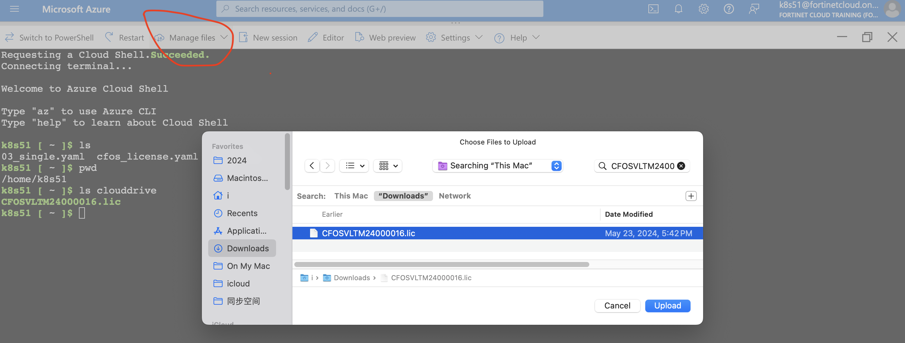

In this chapter, we will do 

- git clone the scripts 
- Create cFOS image pull Secret 
- Create cFOS license ConfigMap
- Bring up cFOS via Deployment 

if you are not familar with K8s Secret and ConfigMap, you can check [ConfigMap and Secret in cFOS](/05configmapsecrets/task4_2_creating_managing_configmaps_secrets.html) for more detail. 
when bring up cFOS, some concept like role, clusterrole will be required,to get better understanding RBAC, role, clusterrole etc, check Chapter 3 and 4.
if you want know more about what is cFOS, check [cFOS overview](/07ingresstraffic/task7_1_overview-of-ingress-in-kubernetes.html#cfos-overview)

### Clone script from github

```bash
cd $HOME
git clone https://github.com/FortinetCloudCSE/k8s-201-workshop.git
cd $HOME/k8s-201-workshop
git pull
cd $HOME
``` 
### Create namespae 

```bash
kubectl create namespace $cfosnamespace
```
### Create image pull secret for k8s 

use below script to create a k8s secret for pulling cfos image from **acr**. you will need an accessToken from acr to create a token. if you prefer to create a yaml file for later reuse. choose option 1. 

{}
if you have your own cfos iamge hosted on other register. you can use that. but keep **secret** with name "cfosimagepullsecret". 
{}

get your acr accessToken. paste to variable accessToken with below command

option 1: create yaml file then apply it 

```bash
read -p "Paste your accessToken:|  " accessToken
echo $accessToken
[ -n "$accessToken" ] && $scriptDir/k8s-201-workshop/scripts/cfos/imagepullsecret.yaml.sh || echo "please set \$accessToken"
kubectl apply -f cfosimagepullsecret.yaml -n cfosingress
```

option 2: use `kubectl create` command to create it 
```bash

read -p "Paste your accessToken:|  " accessToken

echo $accessToken
loginServer="fortinetwandy.azurecr.io"
echo $loginServer 
kubectl create namespace $cfosnamespace
kubectl create secret -n $cfosnamespace docker-registry cfosimagepullsecret \
    --docker-server=$loginServer \
    --docker-username=00000000-0000-0000-0000-000000000000 \
    --docker-password=$accessToken \
    --docker-email=wandy@fortinet.com
```

**Verify the secret**
```bash
kubectl get secret -n cfostest 
```
shall see
```
NAME                  TYPE                             DATA   AGE
cfosimagepullsecret   kubernetes.io/dockerconfigjson   1      38m
```

### Create cFOS configmap license 

cFOS require a license to be functional. once you got your license actived, download the license file and then upload to azure shell. 
do not change or modify license file. 



assume you have downloaded cFOS license file and alread uploaded to your azure cloud shell. the cFOS license file has name "CFOSVLTM24000016.lic".  without need modify any content for your cFOS license. use below script to create a configmap file for cFOS license. once cFOS container boot up , it will automatically get the configmap to apply the license. 

```bash
cd $HOME
cfoslicfilename="CFOSVLTM24000016.lic"
[ ! -f $cfoslicfilename ] && read -p "Input your cfos license file name :|  " cfoslicfilename
$scriptDir/k8s-201-workshop/scripts/cfos/generatecfoslicensefromvmlicense.sh $cfoslicfilename
kubectl apply -f cfos_license.yaml -n $cfosnamespace
```

**check license configmap**

use `kubectl get cm fos-license -o yaml -n cfostest` to check whether license is correct. or use script below to check 

```bash
diff -s -b <(k get cm fos-license -n cfostest -o jsonpath='{.data}' | jq -r .license |  sed '${/^$/d}' ) $cfoslicfilename
```

### Bring up cFOS

Below we use yaml manifest to bring up a cFOS **Deployment**.
it has **annotations** which is to workaround the cFOS mount permission issue. it also include a initContainers for cFOS to get DNS config from k8s, also the replicas is to set to 1. 

```bash
kubectl create namespace cfostest
kubectl apply -f $scriptDir/k8s-201-workshop/scripts/cfos/Task1_1_create_cfos_serviceaccount.yaml  -n cfostest

k8sdnsip=$(k get svc kube-dns -n kube-system -o jsonpath='{.spec.clusterIP}')
cat << EOF | tee > cfos7210250-deployment.yaml
---
apiVersion: apps/v1
kind: Deployment
metadata:
  name: cfos7210250-deployment
  labels:
    app: cfos
spec:
  replicas: 1
  selector:
    matchLabels:
      app: cfos
  template:
    metadata:
      annotations:
        container.apparmor.security.beta.kubernetes.io/cfos7210250-container: unconfined
      labels:
        app: cfos
    spec:
      initContainers:
      - name: init-myservice
        image: busybox
        command:
        - sh
        - -c
        - |
          echo "nameserver $k8sdnsip" > /mnt/resolv.conf
          echo "search default.svc.cluster.local svc.cluster.local cluster.local" >> /mnt/resolv.conf;
        volumeMounts:
        - name: resolv-conf
          mountPath: /mnt
      serviceAccountName: cfos-serviceaccount
      containers:
      - name: cfos7210250-container
        image: $cfosimage
        securityContext:
          privileged: false
          capabilities:
            add: ["NET_ADMIN","SYS_ADMIN","NET_RAW"]
        ports:
        - containerPort: 443
        volumeMounts:
        - mountPath: /data
          name: data-volume
        - mountPath: /etc/resolv.conf
          name: resolv-conf
          subPath: resolv.conf
      volumes:
      - name: data-volume
        emptyDir: {}
      - name: resolv-conf
        emptyDir: {}
      dnsPolicy: ClusterFirst
EOF
kubectl apply -f cfos7210250-deployment.yaml -n cfostest
kubectl rollout status deployment cfos7210250-deployment -n cfostest
```
### Config cFOS 

cFOS by default does not have SSH server installed, so we can not ssh into cFOS for configuration, instead we have to use `kubectl exec` to shell into cFOS for configuration, other way to config cFOS is use configmap and use Rest API.   

for cli configuration, the default username is "admin", no password. 

for use `kubectl exec` to shell into cFOS, we need to know cFOS pod name first, you can use `kubectl get pod -n cfostest` to show pod name, then use `kubectl exec -it po/cfos7210250-deployment-76c8d56d75-mt4jz -n cfostest -- /bin/cli` to get into cFOS.  

```
kubectl get pod -n cfostest
NAME                                      READY   STATUS    RESTARTS   AGE
cfos7210250-deployment-76c8d56d75-mt4jz   1/1     Running   0          13m
```

or you can copy/paste below script to get into cFOS. 

- get into cFOS cli 

```bash
podname=$(kubectl get pod -n cfostest -l app=cfos -o jsonpath='{.items[*].metadata.name}')
kubectl exec -it po/$podname -n cfostest -- /bin/cli
```

enter username admin with empty password. now you can use cFOS cli 

```
User: admin
Password: 
cFOS # diagnose sys status
Version: cFOS v7.2.1 build0255
Serial-Number: 
System time: Fri Jun 28 2024 12:46:41 GMT+0000 (UTC)
```
use `exit` to quit from cFOS cli.


### Q&A 

1. How much cpu/memory does cFOS take in cluster ?
2. How quick does cFOS get into full function from the moment it being created ?
hint: use `kubectl delete -f cfos7210250-deployment.yaml` delete and create it again.


### Cleanup

```bash
kubectl delete -f $scriptDir/k8s-201-workshop/scripts/cfos/Task1_1_create_cfos_serviceaccount.yaml  -n cfostest
kubectl delete namespace cfostest
```
do not delete **cfosimagepullsecret.yaml** and **cfos_license.yaml**, we will need this later.

### What to do Next

if you want learn how to use cFOS for ingress protection , go directly to [Chapter 7](/07ingresstraffic/task7_2_configuring-and-securing-ingress.html#purpose). 

