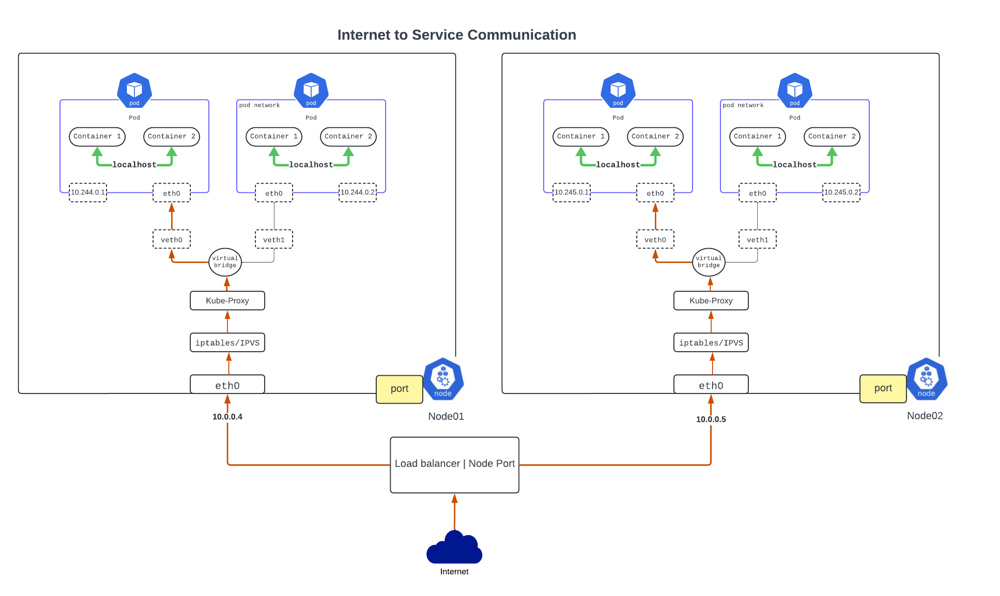

## What is CNI?

The Container Network Interface (CNI) is a standard that defines how network interfaces are managed in Linux containers. It's widely used in container orchestration systems, like Kubernetes, to provide networking for pods and their containers. CNI allows for a plug-and-play approach to network connectivity, supporting a range of networking tasks from basic connectivity to more advanced network configurations.

Here are some of the major CNI plugins widely used across the industry:

- Calico
- Flannel
- Weave Net
- Cilium
- Canal

A managed k8s cluster (AKS) may require integration with a VNET, which may require using the azure CNI (azure-vnet).

- Azure AKS ["azure-vnet"](https://github.com/Azure/azure-container-networking/blob/master/docs/cni.md)
- AWS EKS  ["amazon VPC CNI"](https://github.com/aws/amazon-vpc-cni-k8s)
- Googke GKE ["kubenet" or "calico etc"](https://cloud.google.com/kubernetes-engine/docs/concepts/network-overview)

The cloud providers CNI in a managed k8s allow POD's to use a subnet from a VNET/VPC address space.

A cni configuration is commonly located at the path "/etc/cni/net.d" on each of the nodes.

for example on AKS worker node.

```
azureuser@aks-worker-36032082-vmss000000:~$ sudo cat /etc/cni/net.d/10-azure.conflist 
{
   "cniVersion":"0.3.0",
   "name":"azure",
   "plugins":[
      {
         "type":"azure-vnet",
         "mode":"transparent",
         "ipsToRouteViaHost":["169.254.20.10"],
         "ipam":{
            "type":"azure-vnet-ipam"
         }
      },
      {
         "type":"portmap",
         "capabilities":{
            "portMappings":true
         },
         "snat":true
      }
   ]
}
```
Above you can find the CNI plugin is "azure-vnet". which means POD will use VNET subnet address space. 

## Kubernetes networking basics

Networking is a central part of Kubernetes, but it can be challenging to understand exactly how it is expected to work. There are 4 distinct networking problems to address: 

1. Highly-coupled container-to-container communications: this is solved by Pods and localhost communications.
2. Pod-to-Pod communications: this is the primary focus of this document.
3. Pod-to-Service communications: this is covered by Services.
4. External-to-Service communications: this is also covered by Services.


Kubernetes is all about sharing machines among applications. Typically, sharing machines requires ensuring that two applications do not try to use the same ports. Coordinating ports across multiple developers is very difficult to do at scale and exposes users to cluster-level issues outside of their control.

## Kubernetes IP address ranges

Kubernetes clusters require to allocate non-overlapping IP addresses for Pods, Services and Nodes, from a range of available addresses configured in the following components:

1. The network plugin is configured to assign IP addresses to Pods.
2. The kube-apiserver is configured to assign IP addresses to Services.
3. The kubelet or the cloud-controller-manager is configured to assign IP addresses to Nodes.


## 1. Container-to-Container Networking

Within a pod, containers share the same IP address and port space, which means they can communicate with each other using localhost. This type of networking is the simplest in Kubernetes and is intended for tightly coupled application components that need to communicate frequently and quickly.

**Benefits:** Efficient communication due to shared network namespace; no need for IP management per container.
**Use case:** Inter-process communication within a pod, such as between a web server and a local cache or database.

## 2. Pod-to-Pod Networking

Pod-to-pod communication occurs between pods across the same or different nodes within the Kubernetes cluster. Each pod is assigned a unique IP address, irrespective of which node it resides on. This setup is enabled through a flat network model that allows direct IP routing without NAT between pods.

**Implementation:** Typically handled by a CNI (Container Network Interface) plugin that configures the underlying network to allow seamless pod-to-pod communication. Common plugins include Calico, Weave, and Flannel.

**Challenges:** Ensuring network policies are in place to control access and traffic between pods for security purposes.


## 3. Pod-to-Service Networking

Kubernetes services are abstractions that define a logical set of pods and a policy by which to access them. Services provide stable IP addresses and DNS names to which pods can send requests. Behind the scenes, a service routes traffic to pod endpoints based on labels and selectors.

**Benefits:** Provides a reliable and stable interface for intra-cluster service communication, handling the load balancing across multiple pods.

**Implementation:** Uses kube-proxy, which runs on every node, to route traffic or manage IP tables to direct traffic to the appropriate backend pods.


## 4. External-to-Service Networking

- External-to-service communication is handled through services exposed to the outside of the cluster. This can be achieved in several ways:

- NodePort: Exposes the service on a static port on the node’s IP. External traffic is routed to this port and then forwarded to the appropriate service.

- LoadBalancer: Integrates with external cloud load balancers, providing a public IP that is mapped to the service.

- Ingress: Manages external access to the services via HTTP/HTTPS, providing advanced routing capabilities, SSL termination, and name-based virtual hosting.

**Benefits:** Allows external users and systems to interact with applications running within the cluster in a controlled and secure manner.

**Challenges:** Requires careful configuration to ensure security, such as setting up appropriate firewall rules and security groups.



These different networking types together create a flexible and powerful system for managing both internal and external communications in a Kubernetes environment. The design ensures that applications are scalable, maintainable, and accessible, which is crucial for modern cloud-native applications.


