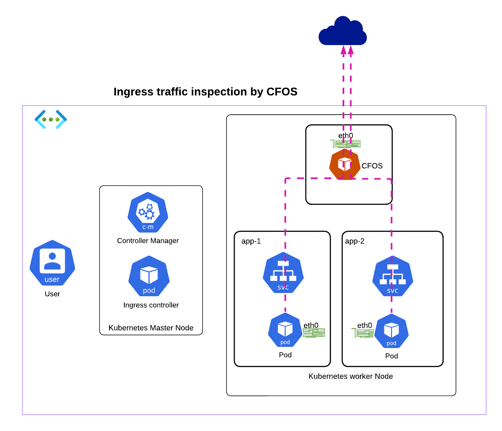
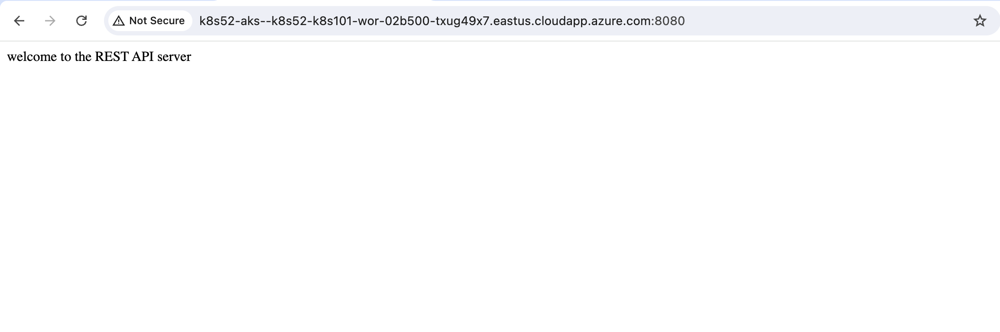
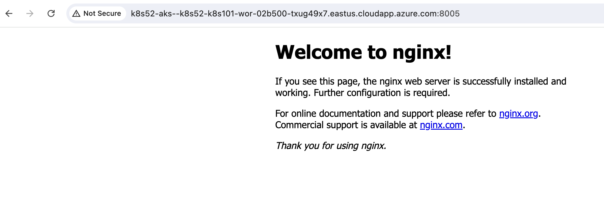
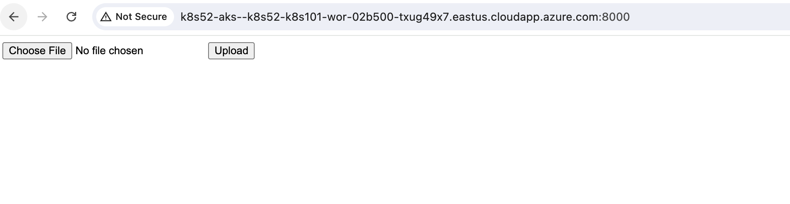

## Ingress



**cFOS installation:**

To install cFOS we have few steps. 

1. Create a name space for cfos ingress.

```kubectl create namespace cfosingress```

2. Create a Secret and config map reader roles and role bindings. 

Use of Cluster Role for ConfigMap Reading:

Configuration Access: Applications or services may need to read configurations stored in ConfigMaps to adjust their operation according to the cluster environment.
Reduced Permissions: By creating a Cluster Role that only allows reading ConfigMaps, you ensure that services or users can't alter the configuration, which helps in maintaining stability and predictability of services.

Use of Cluster Role for Secret Reading:

Sensitive Data Protection: Services or applications often need to read sensitive data at runtime to perform necessary operations like connecting to databases or accessing external APIs. A Cluster Role that allows reading Secrets can provide necessary access without exposing the ability to edit or manage these Secrets.
Security Best Practices: It ensures adherence to the principle of least privilege, reducing the risk of accidental exposure or malicious modifications.

```bash
scriptDir="$HOME"
kubectl apply -f $scriptDir/k8s-201-workshop/scripts/cfos/ingress_demo/01_create_cfos_account.yaml -n cfosingress
```

output:

```
clusterrole.rbac.authorization.k8s.io/configmap-reader configured
rolebinding.rbac.authorization.k8s.io/read-configmaps configured
clusterrole.rbac.authorization.k8s.io/secrets-reader configured
rolebinding.rbac.authorization.k8s.io/read-secrets configured
```

3. Create a configmap file for cfos license

```bash
cat <<EOF | tee cfos_license.yaml
apiVersion: v1
kind: ConfigMap
metadata:
    name: cfos-license
    labels:
        app: cfos
        category: license
data:
    license: |+
EOF
```

4. get your license file, then append the content to yaml file, replace “cfoslicense.lic” with your actual file name

```bash
licfile="cfoslicense.lic"
while read -r line; do printf "      %s\n" "$line"; done < $licfile >> cfos_license.yaml
```

5. Apply the resource

 ```bash
  kubectl create -f cfos_license.yaml -n cfosingress
  ```


6. To run the cfos deployment, copy the below code. This will create a deployment that utilizes the secret, configmap that was deployed.

```bash
cat <<EOF | kubectl create -n cfosingress -f -
apiVersion: apps/v1
kind: Deployment
metadata:
  name: cfos7210250-deployment
  labels:
    app: cfos
spec:
  replicas: 1
  selector:
    matchLabels:
      app: cfos
  template:
    metadata:
      labels:
        app: cfos
    spec:
      containers:
      - name: cfos7210250-container
        image: interbeing/fos:latest
        env:
        - name: cfos-license
          valueFrom:
            configMapKeyRef:
              name: cfos-license
              key: license
        securityContext:
          capabilities:
              add: ["NET_ADMIN","SYS_ADMIN","NET_RAW"]
        ports:
        - containerPort: 80
        volumeMounts:
        - mountPath: /data
          name: data-volume
      imagePullSecrets:
      - name: dockerinterbeing
      volumes:
      - name: data-volume
        hostPath:
          path: /cfosdata
          type: DirectoryOrCreate
EOF
```

output:

```
deployment.apps/cfos7210250-deployment created
```

7. Lets create other services that will help to test egress traffic with cFOS.

```
kubectl create deployment goweb --image=interbeing/myfmg:fileuploadserverx86 -n cfosingress
kubectl expose  deployment goweb --target-port=80  --port=80 -n cfosingress
kubectl create deployment nginx --image=nginx -n cfosingress
kubectl expose deployment nginx --target-port=80 --port=80 -n cfosingress
```

8. Since Cfos POD IP changes each time a pod is re-created. lets create a headless service.we will use the DNS of the service in VIP configuration. the DNS in kuvbernetes follows the notation: **<servicename>.<namespace>.svc.cluster.local**

```bash
cat << EOF | tee headlessservice.yaml
apiVersion: v1
kind: Service
metadata:
  name: cfostest-headless
  namespace: cfosingress
spec:
  clusterIP: None
  selector:
    app: cfos
  ports:
    - protocol: TCP
      port: 80
      targetPort: 80
EOF
kubectl apply -f headlessservice.yaml
```

9. once the services are deployed, take a note of service Cluster-IP's by running 

```
kubectl get service -n cfosingress -o wide
```

output:
```
NAME           TYPE           CLUSTER-IP       EXTERNAL-IP   PORT(S)    AGE   SELECTOR
goweb          ClusterIP      10.107.22.193    <none>        80/TCP     14d   app=goweb
kubernetes     ClusterIP      10.96.0.1        <none>        443/TCP    20d   <none>
nginx          ClusterIP      10.107.230.40    <none>        80/TCP     12d   app=nginx
```

10. Install metalb loadbalancer to expose the cfos service. 

```
kubectl apply -f https://raw.githubusercontent.com/metallb/metallb/v0.14.3/config/manifests/metallb-native.yaml
kubectl rollout status deployment controller -n metallb-system
```

11. create ippool for metallb 

```bash
local_ip=$(kubectl get node -o wide | grep 'control-plane' | awk '{print $6}')
cat <<EOF | tee metallbippool.yaml
apiVersion: metallb.io/v1beta1
kind: IPAddressPool
metadata:
  name: first-pool
  namespace: metallb-system
spec:
  addresses:
  - $local_ip/32
---
apiVersion: metallb.io/v1beta1
kind: L2Advertisement
metadata:
  name: example
  namespace: metallb-system
EOF
```

```kubectl apply -f metallbippool.yaml```

12. Verify the ip pool is created 

```kubectl get ipaddresspool -n metallb-system```

13. Before we expose the cFOS service, we need to create VIP, Firewall policy so we can have the inbound traffic through cFOS to get to nginx, goweb applicatios.


14. To run FOS commands we need to connect to the cFOS container.

Run ```kubectl get pods -n cfosingress```

output: 

```bash
NAME                                     READY   STATUS             RESTARTS   AGE
goweb                                    1/1     Running            1          6d22h
cfos7210250-deployment-796c859b4b-r2qjc  1/1     Running            2          11d
nginx-748c667d99-qmtn4                   1/1     Running            2          11d
samplepod                                1/1     Running            1          6d21h
```

15. copy the name of cFOS pod and run the below command

```kubectl exec --stdin --tty cfos7210250-deployment-796c859b4b-r2qjc -- /bin/cli -n cfosingress```

output:

```
User: 
```

16. User: admin, password: none just hit enter.

17. on cFOS run the command:

```
config system interface
show
```

output:

```
config system interface
    edit "eth0"
        set ip 10.244.145.146 255.255.255.255
        set macaddr ca:4f:53:54:d3:d9
        config ipv6
            set ip6-address fe80::c84f:53ff:fe54:d3d9/64
        end
    next
    edit "any"
    next
end
```

NOTE: Take note of IP address and exit out of container by typing **exit**

18. Configure configmap to create VIP on cFOS to forward the traffic to nginx. 


```bash
cat << EOF | tee cfosconfigmapfirewallvip.yaml
apiVersion: v1
kind: ConfigMap
metadata:
  name: cfosconfigvip
  labels:
      app: cfos
      category: config
data:
  type: partial
  config: |-
    config firewall vip
           edit "nginx"
            set extip "cfostest-headless.cfosingress.svc.cluster.local"
            set mappedip <NGINX service ip from step 4>
            set extintf "eth0"
            set portforward enable
            set extport "8000"
            set mappedport "80"
           next
           edit "goweb"
            set extip "cfostest-headless.cfosingress.svc.cluster.local"
            set mappedip <goweb service ip from step 4>
            set extintf "eth0"
            set portforward enable
            set extport "8005"
            set mappedport "80"
           next
       end
EOF
kubectl create -f cfosconfigmapfirewallvip.yaml -n cfosingress
```

18. Create Firewall policy configmap to allow the inbound traffic to both the VIP's. 

```bash
cat << EOF | tee cfosconfigmapfirewallpolicy.yaml
apiVersion: v1
kind: ConfigMap
metadata:
  name: cfosconfigpolicy
  labels:
      app: cfos
      category: config
data:
  type: partial
  config: |-
    config firewall policy
           edit 1
            set name "nginx"
            set srcintf "eth0"
            set dstintf "eth0"
            set srcaddr "all"
            set dstaddr "nginx"
            set nat enable
           next
           edit 2
            set name "goweb"
            set srcintf "eth0"
            set dstintf "eth0"
            set srcaddr "all"
            set dstaddr "goweb"
            set utm-status enable
            set av-profile default
            set nat enable
           next
       end
EOF
kubectl create -f cfosconfigmapfirewallpolicy.yaml -n cfosingress
```

19. Now exit out of container to expose the cFOS service through metallb.


```bash
cat <<EOF | kubectl create -f - 
apiVersion: v1
kind: Service
metadata:
  name: cfos-service
  annotations:
    metallb.universe.tf/loadBalancerIPs: 10.4.0.4
spec:
  sessionAffinity: ClientIP
  ports:
  - port: 8080
    name: cfos-restapi
    targetPort: 80
  - port: 8000
    name: cfos-nginx
    targetPort: 8000
    protocol: TCP
  - port: 8005
    name: cfos-goweb
    targetPort: 8005
    protocol: TCP
  selector:
    app: fos
  type: LoadBalancer
EOF
```

20. If we now curl on the Loadbalance IP we should see the following responses:

```
sallam@master1:~$ curl 10.4.0.4:8080
welcome to the REST API server

sallam@master1:~$ curl 10.4.0.4:8000
<!DOCTYPE html>
<html>
<head>
<title>Welcome to nginx!</title>
<style>
html { color-scheme: light dark; }
body { width: 35em; margin: 0 auto;
font-family: Tahoma, Verdana, Arial, sans-serif; }
</style>
</head>
<body>
<h1>Welcome to nginx!</h1>
<p>If you see this page, the nginx web server is successfully installed and
working. Further configuration is required.</p>

<p>For online documentation and support please refer to
<a href="http://nginx.org/">nginx.org</a>.<br/>
Commercial support is available at
<a href="http://nginx.com/">nginx.com</a>.</p>

<p><em>Thank you for using nginx.</em></p>
</body>
</html>
```

or on the browser, try the Master_node_publicIP:Port








21. Try uploading the ecira file from eicar website. you should **not** see a successful upload. 

22. To Verify: 

```kubectl get pods```

Copy the name of cfos pod:


```kubectl exec --stdin --tty cfos7210250-deployment-796c859b4b-r2qjc -n cfosingress -- /bin/cli ```

Once logged in, run the log filter:

```
execute log filter device 1
execute log filter category 2
execute log  display
```

You should see an entry for eicar file being blocked. 

```
cFOS # execute log filter device 1
cFOS # execute log filter category 2
cFOS # execute log  display
date=2024-05-22 time=20:04:37 eventtime=1716408277 tz="+0000" logid="0211008192" type="utm" subtype="virus" eventtype="infected" level="warning" policyid=2 msg="File is infected." action="blocked" service="HTTP" sessionid=2 srcip=10.244.153.0 dstip=10.107.22.193 srcport=20535 dstport=80 srcintf="eth0" dstintf="eth0" proto=6 direction="outgoing" filename="eicar.com" checksum="6851cf3c" quarskip="No-skip" virus="EICAR_TEST_FILE" dtype="Virus" ref="http://www.fortinet.com/ve?vn=EICAR_TEST_FILE" virusid=2172 url="http://20.83.183.25/upload" profile="default" agent="Chrome/125.0.0.0" analyticscksum="275a021bbfb6489e54d471899f7db9d1663fc695ec2fe2a2c4538aabf651fd0f" analyticssubmit="false"

date=2024-05-22 time=20:04:37 eventtime=1716408277 tz="+0000" logid="0211008192" type="utm" subtype="virus" eventtype="infected" level="warning" policyid=2 msg="File is infected." action="blocked" service="HTTP" sessionid=1 srcip=10.244.153.0 dstip=10.107.22.193 srcport=26108 dstport=80 srcintf="eth0" dstintf="eth0" proto=6 direction="outgoing" filename="eicar.com" checksum="6851cf3c" quarskip="No-skip" virus="EICAR_TEST_FILE" dtype="Virus" ref="http://www.fortinet.com/ve?vn=EICAR_TEST_FILE" virusid=2172 url="http://20.83.183.25/upload" profile="default" agent="Chrome/125.0.0.0" analyticscksum="275a021bbfb6489e54d471899f7db9d1663fc695ec2fe2a2c4538aabf651fd0f" analyticssubmit="false"


date=2024-05-22 time=20:04:49 eventtime=1716408289 tz="+0000" logid="0211008192" type="utm" subtype="virus" eventtype="infected" level="warning" policyid=2 msg="File is infected." action="blocked" service="HTTP" sessionid=7 srcip=10.244.153.0 dstip=10.107.22.193 srcport=38707 dstport=80 srcintf="eth0" dstintf="eth0" proto=6 direction="outgoing" filename="eicar.com" checksum="6851cf3c" quarskip="No-skip" virus="EICAR_TEST_FILE" dtype="Virus" ref="http://www.fortinet.com/ve?vn=EICAR_TEST_FILE" virusid=2172 url="http://20.83.183.25/upload" profile="default" agent="Chrome/125.0.0.0" analyticscksum="275a021bbfb6489e54d471899f7db9d1663fc695ec2fe2a2c4538aabf651fd0f" analyticssubmit="false"
```


23. or you can also run the below commands to see the AV log. 

```bash
kubectl exec -it po/-n cfos7210250-deployment-796c859b4b-r2qjc -n cfosingress -- sh```
cd /var/log/log
tail virus.0
```

