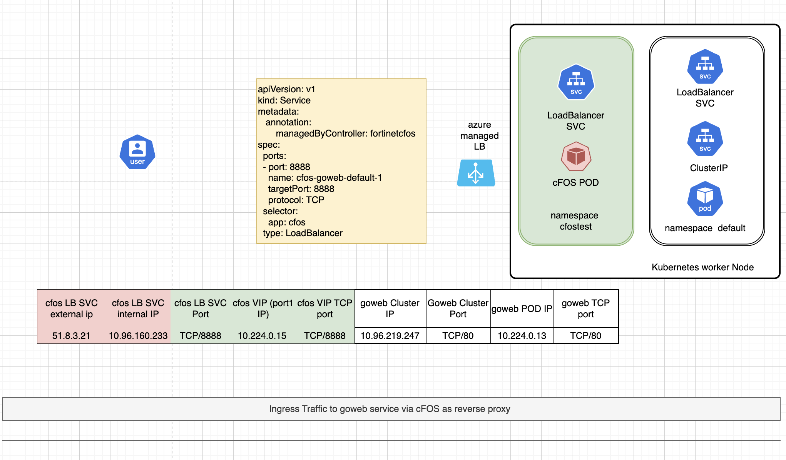

### Purpose

In this chapter, we will use cFOS to provide ingress protection for a target application(**goweb**). The target application is a web server that allows users to upload files. Without cFOS protection, users can upload malicious files. However, with cFOS, uploaded files are scanned, and malicious files are blocked.

We use a load balancer with a public IP to handle ingress traffic from the internet to the target application. We can also use an internal IP or even the cFOS cluster IP to secure traffic from within the Kubernetes cluster or other pods to the target application. Without cFOS, incoming traffic goes directly to the backend application. With cFOS in the middle, the load balancer directs the traffic to cFOS first. cFOS then uses a Firewall VIP to redirect the traffic to the backend application, performing deep inspection along the way.

### Unprotected Application (NO cFOS protection)

Let's create an application and exposed by loadBalancer directly.


{}

```bash
#!/bin/bash -x
cd $HOME
gowebimage="public.ecr.aws/t8s9q7q9/andy2024public:fileuploadserverx86v1.1"
#gowebimage="interbeing/myfmg:fileuploadserverx86"
kubectl create namespace mytest
kubectl create deployment goweb --image=$gowebimage  --namespace mytest
kubectl expose  deployment goweb --target-port=80  --port=80  --namespace mytest
svcname=$(kubectl config view -o json | jq .clusters[0].cluster.server | cut -d "." -f 1 | cut -d "/" -f 3)
metallbip=$(kubectl get ipaddresspool -n metallb-system -o jsonpath='{.items[*].spec.addresses[0]}' 2>/dev/null | cut -d '/' -f 1)
if [ -n "$metallbip" ]; then
   metallbannotation="metallb.universe.tf/loadBalancerIPs: $metallbip"
fi

echo use pool ipaddress $metallbip for svc 

cat << EOF | tee > gowebsvc.yaml 
apiVersion: v1
kind: Service
metadata:
  name: gowebsvc
  annotations:
    $metallbannotation
    service.beta.kubernetes.io/azure-dns-label-name: $svcname
spec:
  sessionAffinity: ClientIP
  ports:
  - port: 8888
    name: goweb-1
    targetPort: 80
    protocol: TCP
  selector:
    app: goweb
  type: LoadBalancer

EOF
kubectl apply -f gowebsvc.yaml --namespace mytest
```

{}
{}

- Review gowebsvc.yaml and check the svc created by k8s with cli like `kubectl get svc -n mytest`

for example, on self-managed k8s, you will see 
```
NAME       TYPE           CLUSTER-IP    EXTERNAL-IP   PORT(S)          AGE
goweb      ClusterIP      10.99.120.6   <none>        80/TCP           2m31s
gowebsvc   LoadBalancer   10.108.22.4   10.0.0.4      8888:31981/TCP   2m30s
```
now, the goweb application is ready for you to upload file

{}
{}
Let's upload  a virus file to goweb

- download eicar_com.zip from eicar.org website

```bash
wget -c https://secure.eicar.org/eicar_com.zip
cp eicar_com.zip $scriptDir/k8s-201-workshop/scripts/cfos/ingress_demo/
```
- send file to application 

```
curl -v -F "file=@$scriptDir/k8s-201-workshop/scripts/cfos/ingress_demo/eicar_com.zip" http://$svcname.$location.cloudapp.azure.com:8888/upload
```
{}
{}
result

```
* Host k8strainingmaster-k8s51-1.eastus.cloudapp.azure.com:8888 was resolved.
* IPv6: (none)
* IPv4: 52.224.164.53
*   Trying 52.224.164.53:8888...
* Connected to k8strainingmaster-k8s51-1.eastus.cloudapp.azure.com (52.224.164.53) port 8888
> POST /upload HTTP/1.1
> Host: k8strainingmaster-k8s51-1.eastus.cloudapp.azure.com:8888
> User-Agent: curl/8.5.0
> Accept: */*
> Content-Length: 401
> Content-Type: multipart/form-data; boundary=------------------------OBqcPObBBZvOi9WnnBwJlX
> 
* We are completely uploaded and fine
< HTTP/1.1 200 OK
< Date: Tue, 02 Jul 2024 06:27:26 GMT
< Content-Length: 0
< 
* Connection #0 to host k8strainingmaster-k8s51-1.eastus.cloudapp.azure.com left intact
```

you will see "We are completely uploaded and fine". 

see below diagram for more detail. 

**traffic diagram without use cFOS**


{}
{}

This procedure demonstrates running an application without protection is dangerous. The application is exposed to various security challenges, including the risk of users uploading malicious files.

If you are on a self-managed Kubernetes cluster with MetalLB as the load balancer and only have one IP in the pool, you will need to delete the service in the `mytest` namespace to free up the IP for other services.


```bash
kubectl delete namespace mytest
```
{}


### Application protected by cFOS 

**traffic diagram after use cFOS in the middle**

With cFOS in the middle, it functions as a reverse proxy. Instead of exposing the application to the internet, we expose cFOS to the internet. cFOS then redirects or proxies traffic to the backend application, ensuring that the traffic passes cFOS security policy checks. cFOS is able to inspect traffic even it's encrypted with SSL. 





{}

```bash
cfosnamespace="cfosingress"
kubectl create namespace $cfosnamespace

```

{}
{}
- Create cFOS license ConfigMap and image pull secret

You should already have created the cFOS license and cFOS image pull secret YAML files in [Chapter 1: Create Secret and cFOS License](/01gettingstarted/5_task4.html#create-image-pull-secret-for-kubernetes). Since we are going to use a different namespace for ingress protection, you can apply the same YAML files to the new namespace.

```bash
cd $HOME
kubectl apply -f cfosimagepullsecret.yaml  -n $cfosnamespace
kubectl apply -f cfos_license.yaml  -n $cfosnamespace
```
{}
{}

- Create a service account for cFOS

The cFOS container will require privileges to read ConfigMaps and Secrets from Kubernetes. To achieve this, we need to create a Role with the necessary permissions. We will then create a ServiceAccount that includes the required Role for cFOS.


```bash
kubectl create -f $scriptDir/k8s-201-workshop/scripts/cfos/ingress_demo/01_create_cfos_account.yaml -n $cfosnamespace
```

{}
{}
output:

```
clusterrole.rbac.authorization.k8s.io/configmap-reader configured
rolebinding.rbac.authorization.k8s.io/read-configmaps configured
clusterrole.rbac.authorization.k8s.io/secrets-reader configured
rolebinding.rbac.authorization.k8s.io/read-secrets configured

```
{}
{}

- Create cFOS deployment

To run the cFOS deployment, copy/paste code below. This will create a deployment that utilizes the previously deployed Secret and ConfigMap.


```bash

k8sdnsip=$(k get svc kube-dns -n kube-system -o jsonpath='{.spec.clusterIP}')
cat << EOF | tee > cfos7210250-deployment.yaml
---
apiVersion: apps/v1
kind: Deployment
metadata:
  name: cfos7210250-deployment
  labels:
    app: cfos
spec:
  replicas: 1
  selector:
    matchLabels:
      app: cfos
  template:
    metadata:
      annotations:
        container.apparmor.security.beta.kubernetes.io/cfos7210250-container: unconfined
      labels:
        app: cfos
    spec:
      initContainers:
      - name: init-myservice
        image: busybox
        command:
        - sh
        - -c
        - |
          echo "nameserver $k8sdnsip" > /mnt/resolv.conf
          echo "search default.svc.cluster.local svc.cluster.local cluster.local" >> /mnt/resolv.conf;
        volumeMounts:
        - name: resolv-conf
          mountPath: /mnt
      serviceAccountName: cfos-serviceaccount
      containers:
      - name: cfos7210250-container
        image: $cfosimage
        securityContext:
          privileged: false
          capabilities:
            add: ["NET_ADMIN","SYS_ADMIN","NET_RAW"]
        ports:
        - containerPort: 443
        volumeMounts:
        - mountPath: /data
          name: data-volume
        - mountPath: /etc/resolv.conf
          name: resolv-conf
          subPath: resolv.conf
      volumes:
      - name: data-volume
        emptyDir: {}
      - name: resolv-conf
        emptyDir: {}
      dnsPolicy: ClusterFirst
EOF
kubectl apply -f cfos7210250-deployment.yaml -n $cfosnamespace
```

{}
{}

check result with
```bash
kubectl get pod -n $cfosnamespace
``` 
result
```
NAME                                    READY   STATUS    RESTARTS   AGE
cfos7210250-deployment-8b6d4b8b-ljjf5   1/1     Running   0          3m13s
```
if you see POD is in "ErrImagePull" instead Running, check your imagepullsecret. 

{}

### Create backend application and service

Let's create a file upload server application and an Nginx application, and expose them with ClusterIP services. The goweb and Nginx applications can be in any namespace; here, we will use the default namespace.


{}


```
gowebimage="public.ecr.aws/t8s9q7q9/andy2024public:fileuploadserverx86v1.1"
kubectl create deployment goweb --image=$gowebimage
kubectl expose  deployment goweb --target-port=80  --port=80 
kubectl create deployment nginx --image=nginx 
kubectl expose deployment nginx --target-port=80 --port=80 
```
{}
{}

check result with 
`kubectl get svc goweb`, `kubectl get svc nginx`, `kubectl get ep goweb`, `kubectl get ep nginx`

Here, goweb and nginx are deployed in the default namespace, while cFOS is deployed in a different namespace. This setup is normal in Kubernetes, as all namespaces within the same cluster can communicate with each other.


result 
```
kubectl get svc
NAME         TYPE        CLUSTER-IP      EXTERNAL-IP   PORT(S)   AGE
goweb        ClusterIP   10.96.131.201   <none>        80/TCP    13m
nginx        ClusterIP   10.96.200.35    <none>        80/TCP    13m
```
and
```
kubectl get ep
NAME         ENDPOINTS           AGE
goweb        10.224.0.13:80      15m
kubernetes   20.121.91.175:443   153m
nginx        10.224.0.28:80      15m
```
{}


### Check whether cFOS can reach backend application 
cFOS can use `execute telnet` command to check backend application 

check below example, if you see **Connected to** then cFOS can reach goweb 

{}
```
k8s51 [ ~ ]$ 
kubectl get svc  goweb
```

```
NAME         TYPE        CLUSTER-IP       EXTERNAL-IP   PORT(S)   AGE
goweb        ClusterIP   10.102.150.225   <none>        80/TCP    4m17s
```
{}
{}

then shell into cFOS with below commands

```sh
podname=$(kubectl get pod -n $cfosnamespace -l app=cfos -o jsonpath='{.items[*].metadata.name}')
kubectl exec -it po/$podname -n $cfosnamespace -- /bin/cli
```

```k8s51 [ ~ ]$ kubectl exec -it po/cfos7210250-deployment-7968d94f44-gfwfm  -n cfosingress -- sh
Defaulted container "cfos7210250-container" out of: cfos7210250-container, init-myservice (init)
# /bin/cli
User: admin
Password: 
```
{}
{}
```
cFOS # execute telnet 10.102.150.225 80

Connected to 10.102.150.225
^C
Console escape. Commands are:

 l      go to line mode
 c      go to character mode
 z      suspend telnet
 e      exit telnet
cFOS # execute telnet goweb.default.svc.cluster.local 80

Connected to goweb.default.svc.cluster.local
^C
Console escape. Commands are:

 l      go to line mode
 c      go to character mode
 z      suspend telnet
 e      exit telnet
```


you can also try with below script, use Ctrl-c to exit

```bash
podname=$(kubectl get pod -l app=cfos -n cfosingress -o jsonpath="{.items[0].metadata.name}")
kubectl exec -it po/$podname -n $cfosnamespace -- sh -c '/bin/busybox telnet goweb.default.svc.cluster.local 80'

```
]
{}


### Create headless svc for cFOS 

Since the cFOS POD IP changes each time a pod is re-created, we will create a [headless service](https://kubernetes.io/docs/concepts/services-networking/service/#headless-services). This will allow us to use the DNS of the service in the VIP configuration. In Kubernetes, the DNS notation follows this format: `<servicename>.<namespace>.svc.cluster.local.`, you might also noticed the service config "clusterIP: None"


{}
```bash
cat << EOF | tee headlessservice.yaml
apiVersion: v1
kind: Service
metadata:
  name: cfostest-headless
spec:
  clusterIP: None
  selector:
    app: cfos
  ports:
    - protocol: TCP
      port: 443
      targetPort: 443
EOF
kubectl apply -f headlessservice.yaml -n $cfosnamespace
```

{}
{}

check result

```bash
kubectl get svc cfostest-headless -n $cfosnamespace
```
result 
```
kubectl get svc cfostest-headless -n $cfosnamespace
NAME                TYPE        CLUSTER-IP   EXTERNAL-IP   PORT(S)   AGE
cfostest-headless   ClusterIP   None         <none>        443/TCP   46s
```

{}
{}

The cfostest-headless is a headless service, so there is no CLUSTER-IP assigned. When we use the DNS name to reach it, DNS will resolve it to the backend application's IP. For example:

```bash
podname=$(kubectl get pod -n $cfosnamespace -l app=cfos -o jsonpath='{.items[*].metadata.name}')
kubectl exec -it po/$podname -n $cfosnamespace -- ip address 
kubectl exec -it po/$podname -n $cfosnamespace -- ping -c 3 cfostest-headless.$cfosnamespace.svc.cluster.local
```
{}
{}

result

```
Defaulted container "cfos7210250-container" out of: cfos7210250-container, init-myservice (init)
PING cfostest-headless.$cfosnamespace.svc.cluster.local (10.224.0.26): 56 data bytes
64 bytes from 10.224.0.26: seq=0 ttl=64 time=0.050 ms
64 bytes from 10.224.0.26: seq=1 ttl=64 time=0.066 ms
```
You will find that the IP address `10.224.0.26` is actually the cFOS interface IP. Therefore, we can use `cfostest-headless.$cfosnamespace.svc.cluster.local` instead of `10.224.0.26` in the cFOS VIP configuration. You might see an IP address other than `10.224.0.26`, but it should match the pod interface IP.

{}


### Config cFOS  


{}
- Create [configmap](/05configmapsecrets/task4_2_creating_managing_configmaps_secrets.html) to enable cFOS rest api on port 8080

```
cat << EOF | tee rest8080.yaml
apiVersion: v1
kind: ConfigMap
metadata:
  name: restapi
  labels:
      app: fos
      category: config
data:
  type: partial
  config: |- 
     config system global
       set admin-port 8080
       set admin-server-cert "Device"
     end
EOF
kubectl apply -f rest8080.yaml -n $cfosnamespace
```


{}
{}

- config VIP configmap for backend application

A few things need to be configured:

**extip** 

The `extip` in the firewall VIP configuration can use either the cFOS pod IP or the headless service DNS name. Since the cFOS pod IP is not persistent and will change if the cFOS container restarts, it is better to use the DNS name instead. This DNS name is the headless service created for cFOS. When using the headless service DNS name, it will be resolved to the actual interface IP.

**mappedip** 

This can be the Nginx/Goweb pod IP or ClusterIP. Since you may have multiple pods for Nginx/Goweb, it is better to use the ClusterIP. You can get the Nginx/Goweb ClusterIP via `kubectl get svc -l app=nginx` and `kubectl get svc -l app=goweb`

or you script below to get clusterip for nginx/goweb 

```bash
nginxclusterip=$(kubectl get svc -l app=nginx  -o jsonpath='{.items[*].spec.clusterIP}')
echo $nginxclusterip
gowebclusterip=$(kubectl get svc -l app=goweb  -o jsonpath='{.items[*].spec.clusterIP}')
echo $gowebclusterip
```

- Create vip configmap 

```bash
cat << EOF | tee cfosconfigmapfirewallvip.yaml
apiVersion: v1
kind: ConfigMap
metadata:
  name: cfosconfigvip
  labels:
      app: fos
      category: config
data:
  type: partial
  config: |-
    config firewall vip
           edit "nginx"
            set extip "cfostest-headless.$cfosnamespace.svc.cluster.local"
            set mappedip $nginxclusterip
            set extintf "eth0"
            set portforward enable
            set extport "8005"
            set mappedport "80"
           next
           edit "goweb"
            set extip "cfostest-headless.$cfosnamespace.svc.cluster.local"
            set mappedip $gowebclusterip
            set extintf "eth0"
            set portforward enable
            set extport "8000"
            set mappedport "80"
           next
       end
EOF
kubectl create -f cfosconfigmapfirewallvip.yaml -n $cfosnamespace
```
{}
{}

**check VIP configuration on cFOS**

Once configured, from cFOS shell , you shall able to find below nat role from **iptables -t nat -L -v**

```bash
podname=$(kubectl get pod -n $cfosnamespace -l app=cfos -o jsonpath='{.items[*].metadata.name}')
echo $podname 
kubectl exec -it po/$podname -n $cfosnamespace -- iptables -t nat -L -v
```
result 

```
Chain fcn_dnat (1 references)
 pkts bytes target     prot opt in     out     source               destination         
    0     0 DNAT       tcp  --  eth0   any     anywhere             cfos7210250-deployment-76c8d56d75-7npvf  tcp dpt:8005 to:10.96.166.251:80
    0     0 DNAT       tcp  --  eth0   any     anywhere             cfos7210250-deployment-76c8d56d75-7npvf  tcp dpt:8000 to:10.96.20.122:80

```
{}
{}

- Create cFOS firewall policy configmap 
 
Create Firewall policy configmap to allow the inbound traffic to both VIP's. 


```bash
cat << EOF | tee cfosconfigmapfirewallpolicy.yaml
apiVersion: v1
kind: ConfigMap
metadata:
  name: cfosconfigpolicy
  labels:
      app: fos
      category: config
data:
  type: partial
  config: |-
    config firewall policy
           edit 1
            set name "nginx"
            set srcintf "eth0"
            set dstintf "eth0"
            set srcaddr "all"
            set dstaddr "nginx"
            set nat enable
           next
           edit 2
            set name "goweb"
            set srcintf "eth0"
            set dstintf "eth0"
            set srcaddr "all"
            set dstaddr "goweb"
            set utm-status enable
            set av-profile default
            set nat enable
           next
       end
EOF
kubectl create -f cfosconfigmapfirewallpolicy.yaml -n $cfosnamespace
```

{}
{}
Once Firewall policy is configured, you can find additional nat rule  from `iptables -t nat -L -v`

```bash
podname=$(kubectl get pod -n $cfosnamespace -l app=cfos -o jsonpath='{.items[*].metadata.name}')
echo $podname 
kubectl exec -it po/$podname -n $cfosnamespace -- iptables -t nat -L -v
```
result:

```
Chain fcn_nat (1 references)
 pkts bytes target     prot opt in     out     source               destination         
    0     0 MASQUERADE  tcp  --  any    any     anywhere             nginx.default.svc.cluster.local  ctorigdst cfos7210250-deployment-76c8d56d75-7npvf ctorigdstport 8005 connmark match  0x10000/0xff0000
    0     0 MASQUERADE  tcp  --  any    any     anywhere             goweb.default.svc.cluster.local  ctorigdst cfos7210250-deployment-76c8d56d75-7npvf ctorigdstport 8000 connmark match  0x10000/0xff0000

Chain fcn_prenat (1 references)
 pkts bytes target     prot opt in     out     source               destination         
    0     0 CONNMARK   all  --  eth0   any     anywhere             anywhere             state NEW CONNMARK xset 0x10000/0xff0000
```
{}
{}

- expose cFOS VIP to external via Load Balancer 

Now exit out of container to expose the cFOS service through azure LB or metalla if you on self-managed k8s


```bash
cd $HOME
svcname=$(kubectl config view -o json | jq .clusters[0].cluster.server | cut -d "." -f 1 | cut -d "/" -f 3)
metallbip=$(kubectl get ipaddresspool -n metallb-system -o jsonpath='{.items[*].spec.addresses[0]}' | cut -d '/' -f 1)
if [ ! -z "$metallbip" ] ; then 
   metallbannotation="metallb.universe.tf/loadBalancerIPs: $metallbip"
fi

echo use pool ipaddress $metallbip for svc 

cat << EOF | tee > 03_single.yaml 
apiVersion: v1
kind: Service
metadata:
  name: cfos7210250-service
  annotations:
    $metallbannotation
    service.beta.kubernetes.io/azure-dns-label-name: $svcname
spec:
  sessionAffinity: ClientIP
  ports:
  - port: 8080
    name: cfos-restapi
    targetPort: 8080
  - port: 8000
    name: cfos-goweb-default-1
    targetPort: 8000
    protocol: TCP
  - port: 8005
    name: cfos-nginx-default-1
    targetPort: 8005
    protocol: TCP
  selector:
    app: cfos
  type: LoadBalancer

EOF
kubectl apply -f 03_single.yaml  -n $cfosnamespace
sleep 5
kubectl get svc cfos7210250-service  -n $cfosnamespace

```
it will take a few seconds to get the loadbalancer IP address. use `kubectl get svc -n $cfosnamespace` to check the external ip.

meanwhile, azure also created dns name for external ip. 

{}
{}

- Verify the result  

If we now curl on the Loadbalance IP we should see the following responses:

```bash
svcip=$(k get svc -n $cfosnamespace -o jsonpath='{.items[0].status.loadBalancer.ingress[0].ip}')
echo $svcip
#curl  http://$svcip:8080
```
if the svcip is internal ip for example, if you on self-managed k8s, the ip is internal 10.0.0.x, you can not access it directly from azure shell. you can use a jumphost pod.

{}
{}

- create jumphost pod

```bash
cat << EOF | tee sshclient.yaml 
apiVersion: v1
kind: Pod
metadata:
  name: ssh-jump-host
  labels:
    app: ssh-jump-host
spec:
  containers:
  - name: ssh-client
    image: alpine
    command: ["/bin/sh"]
    args: ["-c", "apk add --no-cache openssh && apk add --no-cache curl && tail -f /dev/null"]
    stdin: true
    tty: true
EOF

kubectl apply -f sshclient.yaml
```

```bash
kubectl exec -it po/ssh-jump-host -- curl http://$svcip:8080
```
or use dns name 

```bash
curl http://$svcname.$location.cloudapp.azure.com:8080
```
or use clusterip dns name or ip

```bash
cfossvcclusterip=$(kubectl get svc cfos7210250-service -n $cfosnamespace  -o jsonpath='{.spec.clusterIP}')
kubectl exec -it po/ssh-jump-host -- curl http://$cfossvcclusterip:8080
```
or via cfos clusterip dns name 
```bash
kubectl exec -it po/ssh-jump-host -- curl http://cfos7210250-service.$cfosnamespace.svc.cluster.local:8080
```

{}
{}
result

```
welcome to the REST API server

```

Port `8080` is the cFOS REST API port and has nothing to do with the VIP. However, it can be used to verify whether the load balancer can reach cFOS. 

The above verification confirms that traffic from the internet, internal network, or other pods can all reach the cFOS API. Now, let's continue to verify the traffic to the application behind cFOS.

{}
{}
- Verify ingress to backend application 

```bash
curl http://$svcname.$location.cloudapp.azure.com:8000
```
you shall see output 
```
<html><body><form enctype="multipart/form-data" action="/upload" method="post">
<input type="file" name="myFile" />
<input type="submit" value="Upload" />
</form></body></html>
```
and 
```bash
curl http://$svcname.$location.cloudapp.azure.com:8005
```
{}
{}
or on the browser, try http://$svcname.$location.cloudapp.azure.com:8000 or http://$svcname.$location.cloudapp.azure.com:8005


{}
{}

you can also verify the iptables from cfos shell with command `iptables -t nat -L -v`


```bash
podname=$(kubectl get pod -n $cfosnamespace -l app=cfos -o jsonpath='{.items[*].metadata.name}')
echo $podname 
kubectl exec -it po/$podname -n $cfosnamespace -- iptables -t nat -L -v
```
result
```
Chain PREROUTING (policy ACCEPT 23 packets, 1220 bytes)
 pkts bytes target     prot opt in     out     source               destination         
   66  3480 fcn_prenat  all  --  any    any     anywhere             anywhere            
   66  3480 fcn_dnat   all  --  any    any     anywhere             anywhere            

Chain INPUT (policy ACCEPT 23 packets, 1220 bytes)
 pkts bytes target     prot opt in     out     source               destination         

Chain OUTPUT (policy ACCEPT 2 packets, 143 bytes)
 pkts bytes target     prot opt in     out     source               destination         

Chain POSTROUTING (policy ACCEPT 2 packets, 143 bytes)
 pkts bytes target     prot opt in     out     source               destination         
   76  5643 fcn_nat    all  --  any    any     anywhere             anywhere            

Chain fcn_dnat (1 references)
 pkts bytes target     prot opt in     out     source               destination         
   21  1100 DNAT       tcp  --  eth0   any     anywhere             cfos7210250-deployment-76c8d56d75-7npvf  tcp dpt:8005 to:10.96.166.251:80
   22  1160 DNAT       tcp  --  eth0   any     anywhere             cfos7210250-deployment-76c8d56d75-7npvf  tcp dpt:8000 to:10.96.20.122:80

Chain fcn_nat (1 references)
 pkts bytes target     prot opt in     out     source               destination         
   21  1100 MASQUERADE  tcp  --  any    any     anywhere             nginx.default.svc.cluster.local  ctorigdst cfos7210250-deployment-76c8d56d75-7npvf ctorigdstport 8005 connmark match  0x10000/0xff0000
   22  1160 MASQUERADE  tcp  --  any    any     anywhere             goweb.default.svc.cluster.local  ctorigdst cfos7210250-deployment-76c8d56d75-7npvf ctorigdstport 8000 connmark match  0x10000/0xff0000

Chain fcn_prenat (1 references)
 pkts bytes target     prot opt in     out     source               destination         
   66  3480 CONNMARK   all  --  eth0   any     anywhere             anywhere             state NEW CONNMARK xset 0x10000/0xff0000
```

In the chains `fcn_nat` and `fcn_dnat`, the packets and bytes show non-zero numbers, indicating that the ingress is working as expected.
{}


### Test cFOS security feature 


{}

- upload malicious file 

Try uploading the ecira file from eicar website. you should **not** see a successful upload. 

use below script to upload a virus test file **eicar_com.zip** to backend application. you shall expect this is blocked by cFOS.

```bash

curl -F "file=@$scriptDir/k8s-201-workshop/scripts/cfos/ingress_demo/eicar_com.zip" http://$svcname.$location.cloudapp.azure.com:8000/upload
cd $HOME
```

{}
{}

Here is example of result 

```
curl -F "file=@$scriptDir/k8s-201-workshop/scripts/cfos/ingress_demo/eicar_com.zip" http://$svcname.$location.cloudapp.azure.com:8000/upload | grep  "High Security" -A 10
  % Total    % Received % Xferd  Average Speed   Time    Time     Time  Current
                                 Dload  Upload   Total   Spent    Left  Speed
100  5544  100  5143  100   401   553k  44158 --:--:-- --:--:-- --:--:--  676k
        <title>High Security Alert</title>
    </head>
    <body><div class="message-container">
    <div class="logo"></div>
    <h1>High Security Alert</h1>
    <p>You are not permitted to transfer the file "eicar_com.zip" because it is infected with the virus "EICAR_TEST_FILE".</p>
    <table><tbody>
        <tr>
            <td>URL</td>
            <td>http://k8strainingmaster-k8s51-1.eastus.cloudapp.azure.com/upload</td>
        </tr>
        <tr>
            <td>Quarantined File Name</td>
            <td>31db20d1.eicar_com.zip</td>
        </tr>
```

you can compare with previous result [application without cFOS protection](/07ingresstraffic/task7_2_configuring-and-securing-ingress.html#application-without-cfos-protection) where we can successfully upload virus file.

{}
{}
- Check log  from cFOS


```bash
podname=$(kubectl get pod -n $cfosnamespace -l app=cfos -o jsonpath='{.items[*].metadata.name}')
echo $podname 
kubectl exec -it po/$podname -n $cfosnamespace -- /bin/cli
```

Once logged in, run the log filter:

```
execute log filter device 1
execute log filter category 2
execute log  display
```

You should see an entry for eicar file being blocked. 

```
cFOS # execute log filter device 1
cFOS # execute log filter category 2
cFOS # execute log  display
date=2024-05-22 time=20:04:37 eventtime=1716408277 tz="+0000" logid="0211008192" type="utm" subtype="virus" eventtype="infected" level="warning" policyid=2 msg="File is infected." action="blocked" service="HTTP" sessionid=2 srcip=10.244.153.0 dstip=10.107.22.193 srcport=20535 dstport=80 srcintf="eth0" dstintf="eth0" proto=6 direction="outgoing" filename="eicar.com" checksum="6851cf3c" quarskip="No-skip" virus="EICAR_TEST_FILE" dtype="Virus" ref="http://www.fortinet.com/ve?vn=EICAR_TEST_FILE" virusid=2172 url="http://20.83.183.25/upload" profile="default" agent="Chrome/125.0.0.0" analyticscksum="275a021bbfb6489e54d471899f7db9d1663fc695ec2fe2a2c4538aabf651fd0f" analyticssubmit="false"

date=2024-05-22 time=20:04:37 eventtime=1716408277 tz="+0000" logid="0211008192" type="utm" subtype="virus" eventtype="infected" level="warning" policyid=2 msg="File is infected." action="blocked" service="HTTP" sessionid=1 srcip=10.244.153.0 dstip=10.107.22.193 srcport=26108 dstport=80 srcintf="eth0" dstintf="eth0" proto=6 direction="outgoing" filename="eicar.com" checksum="6851cf3c" quarskip="No-skip" virus="EICAR_TEST_FILE" dtype="Virus" ref="http://www.fortinet.com/ve?vn=EICAR_TEST_FILE" virusid=2172 url="http://20.83.183.25/upload" profile="default" agent="Chrome/125.0.0.0" analyticscksum="275a021bbfb6489e54d471899f7db9d1663fc695ec2fe2a2c4538aabf651fd0f" analyticssubmit="false"


date=2024-05-22 time=20:04:49 eventtime=1716408289 tz="+0000" logid="0211008192" type="utm" subtype="virus" eventtype="infected" level="warning" policyid=2 msg="File is infected." action="blocked" service="HTTP" sessionid=7 srcip=10.244.153.0 dstip=10.107.22.193 srcport=38707 dstport=80 srcintf="eth0" dstintf="eth0" proto=6 direction="outgoing" filename="eicar.com" checksum="6851cf3c" quarskip="No-skip" virus="EICAR_TEST_FILE" dtype="Virus" ref="http://www.fortinet.com/ve?vn=EICAR_TEST_FILE" virusid=2172 url="http://20.83.183.25/upload" profile="default" agent="Chrome/125.0.0.0" analyticscksum="275a021bbfb6489e54d471899f7db9d1663fc695ec2fe2a2c4538aabf651fd0f" analyticssubmit="false"
```


you can also run the below commands to see the AV log. 

```bash
podname=$(kubectl get pod -n $cfosnamespace -l app=cfos -o jsonpath='{.items[*].metadata.name}')
echo $podname 
kubectl exec -it po/$podname -n $cfosnamespace -- tail /var/log/log/virus.0
```
{}
{}


- clean up

```bash
kubectl delete namespace $cfosnamespace
kubectl delete -f $scriptDir/k8s-201-workshop/scripts/cfos/ingress_demo/01_create_cfos_account.yaml -n $cfosnamespace
```
{}

### Q&A

1. Please explain whether cFOS can be used to protect ingress traffic to target application from POD in other namespace ?

if answer is Yes. please show cli command in azure shell to verify it. you may use eicar with curl command to run from POD in other namespace.

2. if not using cFOS to protect ingress traffic to goweb, what are other viable solutions ?


