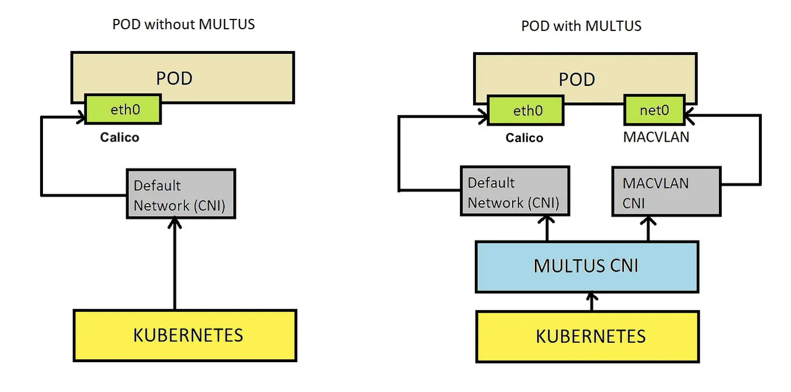

## What is Multus?

Multus is an open-source Container Network Interface (CNI) plugin for Kubernetes that enables attaching multiple network interfaces to pods. This capability significantly enhances networking flexibility and functionality in Kubernetes environments. Here’s a more detailed look at what Multus is and how it functions:

**Core Features of Multus:**

- **Multiple Network Interfaces:** Multus allows each pod in a Kubernetes cluster to have more than one network interface. This is in contrast to the default Kubernetes networking model, which typically assigns only one network interface per pod.

- **Network Customization:** With Multus, users can configure each additional network interface using different CNI plugins. This flexibility allows for a tailored networking setup that can meet specific needs, whether for performance, security, or compliance reasons.

- **Integration with Major CNI Plugins:** Multus works as a "meta-plugin", meaning it acts as a wrapper that can manage other CNI plugins like Flannel, Calico, Weave, etc. It doesn't replace these plugins but instead allows them to be used concurrently.

- **Advanced Networking Capabilities:** By enabling multiple network interfaces, Multus supports advanced networking features such as Software Defined Networking (SDN), Network Function Virtualization (NFV), and more. It can also handle sophisticated networking technologies like SR-IOV, DPDK (Data Plane Development Kit), and VLANs.

## **How Multus Works:**

**Primary Interface:** The primary network interface of a pod is typically handled by the default Kubernetes CNI plugin, which is responsible for the standard pod-to-pod communication across the cluster.

**Secondary Interfaces:** Multus manages additional interfaces. These can be configured to connect to different physical networks, virtual networks, or to provide specialized networking functions that are separate from the default Kubernetes networking.

**Benefits of Using Multus:**

- Enhanced Network Configuration: Provides the ability to use multiple networking configurations within a single cluster, improving performance and enabling more complex networking scenarios.

- Isolation and Security: Allows for traffic isolation between different network interfaces, enhancing security and reducing the risk of cross-network interference.

- Flexibility and Scalability: Offers the flexibility to meet various application needs, from high throughput to network function virtualization, making it easier to scale applications as needed.

Multus is particularly useful in environments where advanced networking configurations are necessary, such as in telecommunications, large enterprise deployments, and applications that require high network performance and security.

