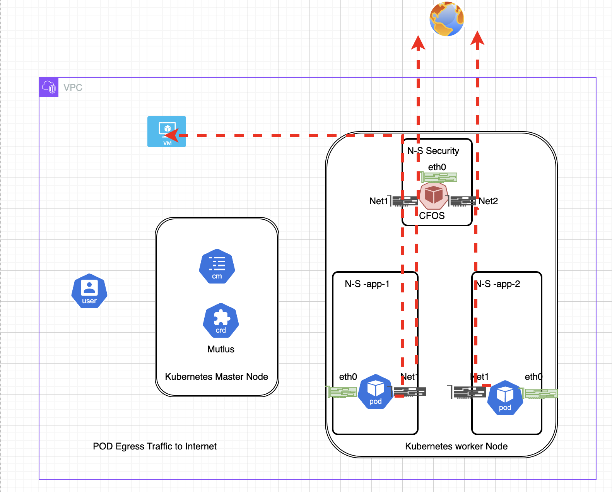

### Why egress security with cFOS

Pod egress security is essential for protecting networks and data from potential threats originating from outgoing traffic in Kubernetes clusters.

Here are some reasons why pod egress security is crucial:

- Prevent data exfiltration: Without proper egress security controls, a malicious actor could potentially use an application running in a pod to exfiltrate sensitive data from the cluster.
- Control outgoing traffic: By restricting egress traffic from pods to specific IP addresses or domains, organizations can prevent unauthorized communication with external entities and control access to external resources.
- Comply with regulatory requirements: Many regulations require organizations to implement controls around outgoing traffic to ensure compliance with data privacy and security regulations. Implementing pod egress security controls can help organizations meet these requirements.
- Prevent malware infections: A pod compromised by malware could use egress traffic to communicate with external command and control servers, leading to further infections and data exfiltration. Egress security controls can help prevent these types of attacks.

In summary, implementing pod egress security controls is a vital part of securing Kubernetes clusters and ensuring the integrity, confidentiality, and availability of organizational data. In this use case, applications can route traffic through a dedicated network created by Multus to the cFOS pod. The cFOS pod inspects packets for IPS attacks, URL filtering, DNS filtering, and performs deep packet inspection for SSL encrypted traffic.

the most common use case for egress security will be 

To stop malicious traffic from application POD to reach destination which is outside of Cluster, such as 

- Internet
- VM such as Database VM in your VPC.


### Lab Diagram

{}
In this chapter, we are going to config cFOS to inspect traffic from two application pod to specfic destination ip addres in internet.

the application pod will use dedicated NIC (NET1) to reach cFOS. the NET1 NIC is inserted by NAD (Net-ATTACH-DEF), two application attach to same NAD or attach to different NAD depends on whether they are using same subnet or different subnet. in this chapter, two application POD use different NAD to attach to cFOS, therefore, cFOS also require attach to two NAD. 

{}



To configure egress with a containerized FortiOS  using Multus CNI in Kubernetes, and ensure that the route for outbound traffic goes through cFOS, you need to follow these general steps:

Key Configurations:

- on cFOS

 1. add extra NIC into cFOS to receive traffic from application pod
 2. apply security profile on incoming traffic from application 

- on Application POD

You have two ways to config static route on application POD

Option 1. 
  1. add specific static route on application pod to make interested destination to cFOS for inspection 
  2. the default route remain unchanged.

Option 2. 
  1. change default route to cFOS
  2. add specific route on application pod to make traffic to in-cluster destination bypass cFOS.

For Option 1, we need add specifc static route in secondary CNI, this is done by create a net-attach-def for application POD. 

For Option 2, we need modify K8s Default CNI to make this happen. this is not always feasible as it depends on what CNI used for default CNI. 

In this workshop, **we use Option 1.** 


Before continue, ensure you have installed [multus CNI](/08deployingmultus/task8_2_installing_multus.html).

### Create application deployment  with NAD


{}
- Create namespace for application 

```bash
kubectl create namespace app-1
```

{}
{}

- Create net-attach-def for app-1

this NAD define a subnet and IPAM pool for NIC to get ip address.
it also defined a few static route with default gateway point to cFOS

below the content under spec.config is the cni json formatted configuration, the json config is different per different cni. for above example below, the macvlan CNI will parse the config based on the config. also beware  that the config section is json formated context which will not be parsed by `NetworkAttachmentDefinition`, therefore, if you have syntax error in this section. when you do kubectl apply , you will not see error messages. 


- Type: macvlan specifies the network plugin.
- Mode: bridge sets the operation mode of the plugin.
- Master: eth0 is the host network interface used by the plugin.
- IPAM: Manages IP allocation, specifies subnet, range, routes, and gateway configurations. host-local means ip allocation is local to this worker node only. it is not cluster wide. if you want use cluster wide ipam, use other ipam like [whereabouts](https://github.com/k8snetworkplumbingwg/whereabouts) 


```bash
cat << EOF | tee > nad_10_1_200_1_1_1_1.yaml 
apiVersion: "k8s.cni.cncf.io/v1"
kind: NetworkAttachmentDefinition
metadata:
  name: nadapplication200
spec:
  config: '{
      "cniVersion": "0.3.0",
      "type": "macvlan",
      "master": "eth0",
      "mode": "bridge",
      "ipam": {
        "type": "host-local",
        "subnet": "10.1.200.0/24",
        "rangeStart": "10.1.200.20",
        "rangeEnd": "10.1.200.100",
        "routes": [
         { "dst": "1.1.1.1/32", "gw": "10.1.200.252"},
         { "dst": "34.117.0.0/16", "gw": "10.1.200.252"},
         { "dst": "10.1.100.0/24", "gw": "10.1.200.252"} 
        ],
        "gateway": "10.1.200.252"
      }
    }'
EOF
kubectl apply -f nad_10_1_200_1_1_1_1.yaml -n app-1
```

{}
{}

check with `kubectl get net-attach-def -n app-1`


```bash
kubectl get net-attach-def -n app-1 -o jsonpath="{.items[0].spec.config}" | jq .
```
output

```
{
  "cniVersion": "0.3.0",
  "type": "macvlan",
  "master": "eth0",
  "mode": "bridge",
  "ipam": {
    "type": "host-local",
    "subnet": "10.1.200.0/24",
    "rangeStart": "10.1.200.20",
    "rangeEnd": "10.1.200.100",
    "routes": [
      {
        "dst": "1.1.1.1/32",
        "gw": "10.1.200.252"
      },
      {
        "dst": "34.117.0.0/16",
        "gw": "10.1.200.252"
      },
      {
        "dst": "10.1.100.0/24",
        "gw": "10.1.200.252"
      }
    ],
    "gateway": "10.1.200.252"
  }
}
```
you can use `kubectl logs -f -l app=multus -n kube-system` to check the log for how detail about net-attach-log creationg etc., 

{}
{}
- create application deployment
when create application, we will use annotation to associate application with **NAD** we just created 

```bash
cat << EOF | tee > demo_application_nad_200.yaml 
apiVersion: v1
kind: Pod
metadata:
  name: diag200
  labels: 
    app: diag
  annotations:
    k8s.v1.cni.cncf.io/networks: '[ { "name": "nadapplication200" } ]'
spec:
  containers:
  - name: praqma
    image: praqma/network-multitool
    args: 
      - /bin/sh
      - -c 
      - /usr/sbin/nginx -g "daemon off;"
    securityContext:
      capabilities:
        add: ["NET_ADMIN","SYS_ADMIN","NET_RAW"]
    volumeMounts:
    - name: host-root
      mountPath: /host
  volumes:
  - name: host-root
    hostPath:
      path: /
      type: Directory
EOF
kubectl apply -f demo_application_nad_200.yaml -n app-1
```

{}
{}

use command `kubectl describe po/diag200 -n app-1` to check the application shall get second NIC 

for example 
```bash
kubectl get po/diag200 -n app-1 -o jsonpath='{.metadata.annotations}'  | jq -r '.["k8s.v1.cni.cncf.io/network-status"]'
```
result

```
[{
    "name": "azure", <<<or k8s-pod-network if you are on self-managed k8s
    "ips": [
        "10.224.0.8"
    ],
    "default": true,
    "dns": {
        "nameservers": [
            "168.63.129.16"
        ]
    },
    "gateway": [
        "10.224.0.1"
    ]
},{
    "name": "app-1/nadapplication200",
    "interface": "net1",
    "ips": [
        "10.1.200.21"
    ],
    "mac": "6a:d7:a6:da:0a:a6",
    "dns": {}
}]
```

above you will find this application pod has two NIC, the first one is from azure CNI with ip 10.224.0.8 which is default gateway, the second interface is **net1** with ip **10.1.200.21** 

{}
{}


- create another namespace 

```bash
kubectl create namespace app-2
```

{}
{}
- create nad for app-2

```bash
cat << EOF | tee > nad_10_1_100_1_1_1_1.yaml 
apiVersion: "k8s.cni.cncf.io/v1"
kind: NetworkAttachmentDefinition
metadata:
  name: nadapplication100
spec:
  config: '{
      "cniVersion": "0.3.0",
      "type": "macvlan",
      "master": "eth0",
      "mode": "bridge",
      "ipam": {
        "type": "host-local",
        "subnet": "10.1.100.0/24",
        "rangeStart": "10.1.100.20",
        "rangeEnd": "10.1.100.100",
        "routes": [
         { "dst": "1.1.1.1/32", "gw": "10.1.100.252"},
         { "dst": "34.117.0.0/16", "gw": "10.1.100.252"},
         { "dst": "10.1.200.0/24", "gw": "10.1.100.252"} 
        ],
        "gateway": "10.1.100.252"
      }
    }'
EOF
kubectl apply -f nad_10_1_100_1_1_1_1.yaml  -n app-2
```

{}
{}
- create application deployment in app-2 namespace

```bash
cat << EOF | tee demo_application_nad_100.yaml
apiVersion: v1
kind: Pod
metadata:
  name: diag100
  labels: 
    app: diag
  annotations:
    k8s.v1.cni.cncf.io/networks: '[ { "name": "nadapplication100" } ]'
spec:
  containers:
  - name: praqma
    image: praqma/network-multitool
    args: 
      - /bin/sh
      - -c 
      - /usr/sbin/nginx -g "daemon off;"
    securityContext:
      capabilities:
        add: ["NET_ADMIN","SYS_ADMIN","NET_RAW"]
    volumeMounts:
    - name: host-root
      mountPath: /host
  volumes:
  - name: host-root
    hostPath:
      path: /
      type: Directory
EOF
kubectl apply -f demo_application_nad_100.yaml -n app-2
```
{}


### Create CFOS [DaemonSet](https://kubernetes.io/docs/concepts/workloads/controllers/daemonset/) nad NAD

**Creating NAD for cFOS**

In this workshop, we will create two Network Attachment Definitions (NADs) for cFOS, each connecting to applications in different namespaces. Specifically:

- One NAD will connect to the application in namespace `app-1`.
- Another NAD will connect to the application in namespace `app-2`.

We aim to have `app-1` and `app-2` on different subnets, necessitating separate NADs for each.

### NADs to be Created:

1. **NAD `cfosdefaultcni6`**:
   - Subnet: `10.1.200.0/24`
   
2. **NAD `cfosdefaultcni6100`**:
   - Subnet: `10.1.100.0/24`

In these NADs, we will restrict the available IP address to a single one. This ensures that cFOS always receives the same IP address. Since cFOS is deployed as a DaemonSet, which means only one POD per worker node, deploying multiple nodes with the same NAD file will result in each cFOS POD on different nodes having the same IP address.


{}

- NAD cfosdefaultcni6

```bash
kubectl create namespace cfosegress
cat << EOF | tee > nad_10_1_200_252_cfos.yaml 
apiVersion: "k8s.cni.cncf.io/v1"
kind: NetworkAttachmentDefinition
metadata:
  name: cfosdefaultcni6
spec:
  config: '{
      "cniVersion": "0.3.0",
      "type": "macvlan",
      "master": "eth0",
      "mode": "bridge",
      "ipam": {
        "type": "host-local",
        "subnet": "10.1.200.0/24",
        "rangeStart": "10.1.200.252",
        "rangeEnd": "10.1.200.252",
        "gateway": "10.1.200.1"
      }
    }'
EOF
kubectl apply -f nad_10_1_200_252_cfos.yaml -n cfosegress
```

{}
{}

- NAD cfosdefaultcni6100

```bash
cat << EOF | tee > nad_10_1_100_252_cfos.yaml  
apiVersion: "k8s.cni.cncf.io/v1"
kind: NetworkAttachmentDefinition
metadata:
  name: cfosdefaultcni6100
spec:
  config: '{
      "cniVersion": "0.3.0",
      "type": "macvlan",
      "master": "eth0",
      "mode": "bridge",
      "ipam": {
        "type": "host-local",
        "subnet": "10.1.100.0/24",
        "rangeStart": "10.1.100.252",
        "rangeEnd": "10.1.100.252",
        "gateway": "10.1.100.1"
      }
    }'
EOF
kubectl apply -f nad_10_1_100_252_cfos.yaml -n cfosegress
```

{}
{}

check

```bash
kubectl get net-attach-def -n cfosegress
```
result
```
NAME                 AGE
cfosdefaultcni6      27m
cfosdefaultcni6100   27m
```

For more detail, you can use `kubectl get net-attach-def -n cfosegress -o yaml` 
If you want to know detail of each field, use `kubectl explain net-attach-def`

{}
{}

- Create cFOS DaemonSet

We are creating DaemonSet instead deployment as each worker node require deployment one cFOS container. the DaemonSet mean cFOS POD always use replicas=1, each k8s worker node will have one cFOS. 

application which has route point to cFOS will always use cFOS on same worker node.

- Create cFOS license configmap and image pull secret

you shall already have cFOS license and cFOS image pull secret yaml file created in Chapter 1, since we are going to use different namespace for ingress protection. you can apply same yaml file to different namespace.

```bash
cd $HOME
kubectl apply -f cfosimagepullsecret.yaml  -n cfosegress
kubectl apply -f cfos_license.yaml  -n cfosegress
``` 
{}
{}
- create serviceaccount for cFOS
```bash
kubectl apply -f $scriptDir/k8s-201-workshop/scripts/cfos/ingress_demo/01_create_cfos_account.yaml -n cfosegress
```
{}
{}

- deploy cFOS DS*

the cFOS will be associated with two NAD, as it will connect to two different subnets. this is done by add annotation in the spec. 

```bash
k8sdnsip=$(k get svc kube-dns -n kube-system -o jsonpath='{.spec.clusterIP}')
cat << EOF | tee > 02_create_cfos_ds.yaml
---
apiVersion: apps/v1
kind: DaemonSet
metadata:
  name: fos-multus-deployment
  labels:
    app: cfos
spec:
  selector:
    matchLabels:
      app: cfos
  template:
    metadata:
      annotations:
        container.apparmor.security.beta.kubernetes.io/cfos7210250-container: unconfined
        k8s.v1.cni.cncf.io/networks: '[ { "name": "cfosdefaultcni6",  "ips": [ "10.1.200.252/32" ], "mac": "CA:FE:C0:FF:00:02"  }, { "name": "cfosdefaultcni6100",  "ips": [ "10.1.100.252/32" ], "mac": "CA:FE:C0:FF:01:00" } ]'
      labels:
        app: cfos
    spec:
      initContainers:
      - name: init-myservice
        image: busybox
        command:
        - sh
        - -c
        - |
          echo "nameserver $k8sdnsip" > /mnt/resolv.conf
          echo "search default.svc.cluster.local svc.cluster.local cluster.local" >> /mnt/resolv.conf;
        volumeMounts:
        - name: resolv-conf
          mountPath: /mnt
      serviceAccountName: cfos-serviceaccount
      containers:
      - name: cfos7210250-container
        image: $cfosimage
        securityContext:
          privileged: false
          capabilities:
            add: ["NET_ADMIN","SYS_ADMIN","NET_RAW"]
        ports:
        - containerPort: 443
        volumeMounts:
        - mountPath: /data
          name: data-volume
        - mountPath: /etc/resolv.conf
          name: resolv-conf
          subPath: resolv.conf
      volumes:
      - name: data-volume
        emptyDir: {}
      - name: resolv-conf
        emptyDir: {}
      dnsPolicy: ClusterFirst
EOF
kubectl apply -f 02_create_cfos_ds.yaml -n cfosegress
kubectl rollout status daemonset fos-multus-deployment -n cfosegress

```

{}
{}

check 

shell into cFOS, to check the ip address 

```bash
podname=$(kubectl get pod -n cfosegress -l app=cfos -o jsonpath='{.items[*].metadata.name}')
kubectl exec -it po/$podname -n cfosegress -- ip address
```
from cFOS cli, you can find cFOS show two interfaces. 

```
kubectl exec -it po/$podname -n cfosegress -- /bin/cli
```
type `show system interface` after login 

Defaulted container "cfos7210250-container" out of: cfos7210250-container, init-myservice (init)
```
User: admin
Password: 
cFOS # show system interface 
config system interface
    edit "net1"
        set ip 10.1.200.252 255.255.255.0
        set macaddr ca:fe:c0:ff:00:02
        config ipv6
            set ip6-address fe80::c8fe:c0ff:feff:2/64
        end
    next
    edit "net2"
        set ip 10.1.100.252 255.255.255.0
        set macaddr ca:fe:c0:ff:01:00
        config ipv6
            set ip6-address fe80::c8fe:c0ff:feff:100/64
        end
    next
    edit "eth0"
        set ip 10.224.0.6 255.255.255.0
        set macaddr 1e:79:6d:1b:51:a8
        config ipv6
            set ip6-address fe80::1c79:6dff:fe1b:51a8/64
        end
    next
    edit "any"
    next
end

```
cFOS will use route tabl 231 for handle traffic. 
```
kubectl exec -it po/$podname -n cfosegress -- ip route show table 231
```
result
```
Defaulted container "cfos7210250-container" out of: cfos7210250-container, init-myservice (init)
default via 169.254.1.1 dev eth0 proto static metric 100 
10.1.100.0/24 dev net2 proto kernel scope link src 10.1.100.252 metric 100 
10.1.200.0/24 dev net1 proto kernel scope link src 10.1.200.252 metric 100 
169.254.1.1 dev eth0 proto static scope link metric 100 
```
you can find the cFOS default route is default CNI assigned interface which is eth0.  

{}


### Config CFOS 


{}


- create firewall policy configmap

The firewall policy allow traffic from net1 and net2 with destination to internet and inspected with utm profiles.

```bash
cat << EOF | tee > net1net2cmtointernetfirewallpolicy.yaml
apiVersion: v1
kind: ConfigMap
metadata:
  name: net1net2
  labels:
      app: fos
      category: config
data:
  type: partial
  config: |-
    config firewall policy
        edit 100
            set utm-status enable
            set name "net1tointernet"
            set srcintf "net1"
            set dstintf "eth0"
            set srcaddr "all"
            set dstaddr "all"
            set service "ALL"
            set ssl-ssh-profile "deep-inspection"
            set av-profile "default"
            set ips-sensor "high_security"
            set application-list "default"
            set nat enable
            set logtraffic all
        next
    end
    config firewall policy
        edit 101
            set utm-status enable
            set name "net2tointernet"
            set srcintf "net2"
            set dstintf "eth0"
            set srcaddr "all"
            set dstaddr "all"
            set service "ALL"
            set ssl-ssh-profile "deep-inspection"
            set av-profile "default"
            set ips-sensor "high_security"
            set application-list "default"
            set nat enable
            set logtraffic all
        next
    end
EOF
kubectl apply -f net1net2cmtointernetfirewallpolicy.yaml -n cfosegress
```
{}
{}

- Send regular  traffic from app-1 namespace pod

this traffic will be send to cFOS to reach internet. the destination **ipinfo.io** will be resolve into ip address in subnet **34.117.186.0/24** which already added into application pod to send to cFOS.  

```bash
kubectl exec -it po/diag200 -n app-1 -- curl ipinfo.io
```
you shall see output 
```
{
  "ip": "52.179.92.240",
  "city": "Ashburn",
  "region": "Virginia",
  "country": "US",
  "loc": "39.0437,-77.4875",
  "org": "AS8075 Microsoft Corporation",
  "postal": "20147",
  "timezone": "America/New_York",
  "readme": "https://ipinfo.io/missingauth"
}
```

{}
{}


you can try do sniff on cFOS to check the packet detail 

- Send malicous traffic 

```bash
kubectl exec -it po/diag200 -n app-1 -- curl --max-time 5 -H "User-Agent: () { :; }; /bin/ls" http://www.vulnweb.com
```
it's expected that you wont get response as it droped by cFOS. as this traffic will be blocked by cFOS because it will be marked as malicious by cFOS IPS profile.


{}
{}
- do same on app-2

```bash
kubectl exec -it po/diag100 -n app-2 -- curl --max-time 5 -H "User-Agent: () { :; }; /bin/ls" http://www.vulnweb.com

```
- Check Result

```bash
podname=$(kubectl get pod -n cfosegress -l app=cfos -o jsonpath='{.items[*].metadata.name}')
kubectl exec -it po/$podname -n cfosegress -- tail -f /data/var/log/log/ips.0

```
expected output

```
date=2024-06-27 time=08:09:14 eventtime=1719475754 tz="+0000" logid="0419016384" type="utm" subtype="ips" eventtype="signature" level="alert" severity="critical" srcip=10.1.200.20 dstip=34.117.186.192 srcintf="net1" dstintf="eth0" sessionid=3 action="dropped" proto=6 service="HTTP" policyid=100 attack="Bash.Function.Definitions.Remote.Code.Execution" srcport=60598 dstport=80 hostname="ipinfo.io" url="/" direction="outgoing" attackid=39294 profile="high_security" incidentserialno=157286403 msg="applications3: Bash.Function.Definitions.Remote.Code.Execution"
date=2024-06-27 time=08:15:50 eventtime=1719476150 tz="+0000" logid="0419016384" type="utm" subtype="ips" eventtype="signature" level="alert" severity="critical" srcip=10.1.200.20 dstip=34.117.186.192 srcintf="net1" dstintf="eth0" sessionid=5 action="dropped" proto=6 service="HTTP" policyid=100 attack="Bash.Function.Definitions.Remote.Code.Execution" srcport=41864 dstport=80 hostname="ipinfo.io" url="/" direction="outgoing" attackid=39294 profile="high_security" incidentserialno=157286406 msg="applications3: Bash.Function.Definitions.Remote.Code.Execution"
date=2024-06-27 time=08:16:09 eventtime=1719476169 tz="+0000" logid="0419016384" type="utm" subtype="ips" eventtype="signature" level="alert" severity="critical" srcip=10.1.100.20 dstip=34.117.186.192 srcintf="net1" dstintf="eth0" sessionid=7 action="dropped" proto=6 service="HTTP" policyid=100 attack="Bash.Function.Definitions.Remote.Code.Execution" srcport=39216 dstport=80 hostname="ipinfo.io" url="/" direction="outgoing" attackid=39294 profile="high_security" incidentserialno=157286409 msg="applications3: Bash.Function.Definitions.Remote.Code.Execution"
```

{}


### Q&A

1. In cFOS egress use case, what is the purpose of use multus CNI ?

{}

```bash
Steer traffic from protected POD to cFOS  
```
{}
2. config cFOS add web filter feature to block traffic to www.casino.org 

Answer:

{} 
```bash
1. Modify NAD for application to insert route to www.casino.org
2. Modify cFOS in firewall policy to add web filter profile 
3. send traffic from application pod
4. check web filter log
```
{}


### Next

Do not delete environment, we will use same for next Task Secure POD to POD east-west traffic
