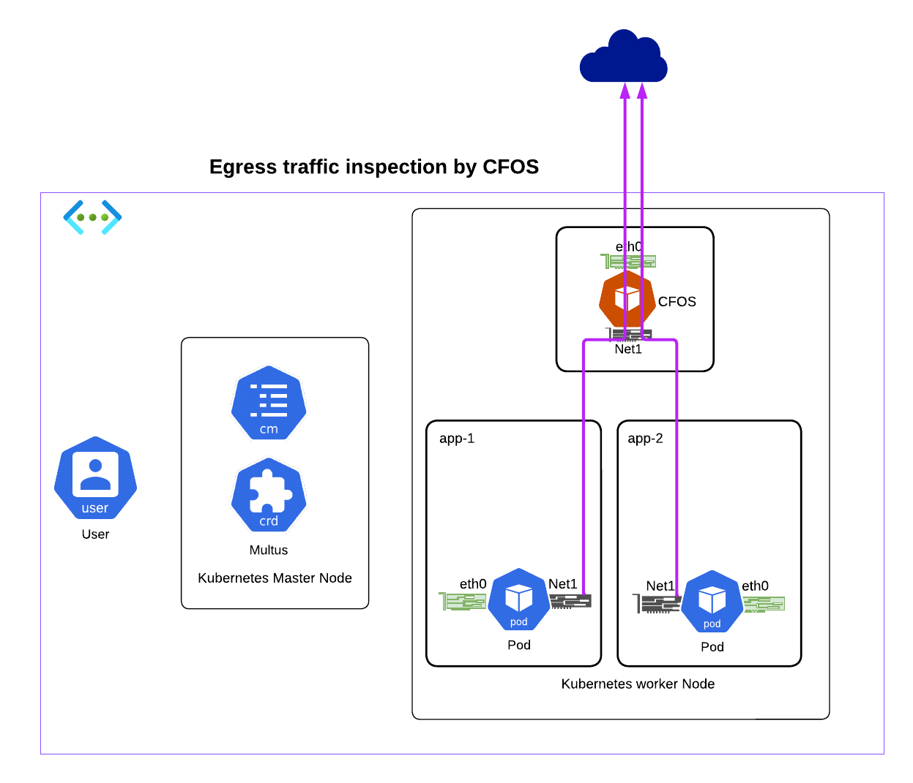

To configure egress with a containerized FortiOS using Multus CNI in Kubernetes, and ensure that the default route for outbound traffic goes through FortiOS, you need to follow these general steps:

Key Configurations:

Multus Network Configuration: Define the network attachment definitions to enable multiple network interfaces on the pods.
Default Route Setup: Ensure that the default route for egress traffic from the application pods is through the FortiOS container.
FortiOS Egress Rules: Configure FortiOS to handle and secure outbound traffic from the Kubernetes pods.

Configuration Details:

- Create namespace for application 

```bash
kubectl create namespace app-1
```
- Create NAD - Net-Attach-DE for app-1

this nad config will insert a NIC to application pod.
it also config a few static route point to cFOS 

```bash
cat << EOF | tee > nad_10_1_200_1_1_1_1.yaml 
apiVersion: "k8s.cni.cncf.io/v1"
kind: NetworkAttachmentDefinition
metadata:
  name: nadapplication200
spec:
  config: '{
      "cniVersion": "0.3.0",
      "type": "macvlan",
      "master": "eth0",
      "mode": "bridge",
      "ipam": {
        "type": "host-local",
        "subnet": "10.1.200.0/24",
        "rangeStart": "10.1.200.20",
        "rangeEnd": "10.1.200.100",
        "routes": [
         { "dst": "1.1.1.1/32", "gw": "10.1.200.252"},
         { "dst": "34.117.186.0/24", "gw": "10.1.200.252"},
         { "dst": "10.1.100.0/24", "gw": "10.1.200.252"} 
        ],
        "gateway": "10.1.200.252"
      }
    }'
EOF
kubectl apply -f nad_10_1_200_1_1_1_1.yaml -n app-1
```
- create application deployment


```bash
cat << EOF | tee > demo_application_nad_200.yaml 
apiVersion: v1
kind: Pod
metadata:
  name: diag200
  labels: 
    app: diag
  annotations:
    k8s.v1.cni.cncf.io/networks: '[ { "name": "nadapplication200" } ]'
spec:
  containers:
  - name: praqma
    image: praqma/network-multitool
    args: 
      - /bin/sh
      - -c 
      - /usr/sbin/nginx -g "daemon off;"
    securityContext:
      capabilities:
        add: ["NET_ADMIN","SYS_ADMIN","NET_RAW"]
    volumeMounts:
    - name: host-root
      mountPath: /host
  volumes:
  - name: host-root
    hostPath:
      path: /
      type: Directory
EOF
kubectl apply -f demo_application_nad_200.yaml -n app-1
```
- create another namespace 

```bash
kubectl create namespace app-2
```

- create nad for app-2

```bash
cat << EOF | tee > nad_10_1_100_1_1_1_1.yaml 
apiVersion: "k8s.cni.cncf.io/v1"
kind: NetworkAttachmentDefinition
metadata:
  name: nadapplication100
spec:
  config: '{
      "cniVersion": "0.3.0",
      "type": "macvlan",
      "master": "eth0",
      "mode": "bridge",
      "ipam": {
        "type": "host-local",
        "subnet": "10.1.100.0/24",
        "rangeStart": "10.1.100.20",
        "rangeEnd": "10.1.100.100",
        "routes": [
         { "dst": "1.1.1.1/32", "gw": "10.1.100.252"},
         { "dst": "34.117.186.0/24", "gw": "10.1.100.252"},
         { "dst": "10.1.200.0/24", "gw": "10.1.100.252"} 
        ],
        "gateway": "10.1.100.252"
      }
    }'
EOF
kubectl apply -f nad_10_1_100_1_1_1_1.yaml  -n app-2
```
- create application deployment in app-2 namespace

```bash
cat << EOF | tee demo_application_nad_100.yaml
apiVersion: v1
kind: Pod
metadata:
  name: diag100
  labels: 
    app: diag
  annotations:
    k8s.v1.cni.cncf.io/networks: '[ { "name": "nadapplication100" } ]'
spec:
  containers:
  - name: praqma
    image: praqma/network-multitool
    args: 
      - /bin/sh
      - -c 
      - /usr/sbin/nginx -g "daemon off;"
    securityContext:
      capabilities:
        add: ["NET_ADMIN","SYS_ADMIN","NET_RAW"]
    volumeMounts:
    - name: host-root
      mountPath: /host
  volumes:
  - name: host-root
    hostPath:
      path: /
      type: Directory
EOF
kubectl apply -f demo_application_nad_100.yaml -n app-2
```


- Create NAD for cFOS 

this will create two subnets with single ip address 10.1.200.252/32  and 10.1.100.252/32 for cFOS 

**subnet 10.1.200.0/24**
```bash
kubectl create namespace cfosegress
cat << EOF | tee > nad_10_1_200_252_cfos.yaml 
apiVersion: "k8s.cni.cncf.io/v1"
kind: NetworkAttachmentDefinition
metadata:
  name: cfosdefaultcni6
spec:
  config: '{
      "cniVersion": "0.3.0",
      "type": "macvlan",
      "master": "eth0",
      "mode": "bridge",
      "ipam": {
        "type": "host-local",
        "subnet": "10.1.200.0/24",
        "rangeStart": "10.1.200.252",
        "rangeEnd": "10.1.200.252",
        "gateway": "10.1.200.1"
      }
    }'
EOF
kubectl apply -f nad_10_1_200_252_cfos.yaml -n cfosegress

```
**subne 10.1.100.0/24**

```bash
cat << EOF | tee > nad_10_1_100_252_cfos.yaml  
apiVersion: "k8s.cni.cncf.io/v1"
kind: NetworkAttachmentDefinition
metadata:
  name: cfosdefaultcni6100
spec:
  config: '{
      "cniVersion": "0.3.0",
      "type": "macvlan",
      "master": "eth0",
      "mode": "bridge",
      "ipam": {
        "type": "host-local",
        "subnet": "10.1.100.0/24",
        "rangeStart": "10.1.100.252",
        "rangeEnd": "10.1.100.252",
        "gateway": "10.1.100.1"
      }
    }'
EOF
kubectl apply -f nad_10_1_100_252_cfos.yaml -n cfosegress
```

- create CFOS daemonSet 

We are creating DaemonSet instead deployment as each worker node require deployment one cfos container.
application which has route point to cFOS will always use cFOS on same worker node.

**create cfosimagepull secret**
```bash
[ -n "$accessToken" ] && $scriptDir/k8s-201-workshop/scripts/cfos/imagepullsecret.yaml.sh || echo "please set \$accessToken"
kubectl apply -f cfosimagepullsecret.yaml -n cfosegress
kubectl get sa -n cfosingress
```
**create cfos license**
```bash
licfile="$scriptDir/CFOSVLTM24000016.lic"
while read -r line; do printf "      %s\n" "$line"; done < $licfile >> cfos_license.yaml
kubectl create -f cfos_license.yaml -n cfosegress
```
**create serviceaccount for cFOS**
```bash
kubectl apply -f $scriptDir/k8s-201-workshop/scripts/cfos/ingress_demo/01_create_cfos_account.yaml -n cfosegress
```
**deploy cfos DS**

```bash
k8sdnsip=$(k get svc kube-dns -n kube-system -o jsonpath='{.spec.clusterIP}')
cat << EOF | tee > 02_create_cfos_ds.yaml
---
apiVersion: apps/v1
kind: DaemonSet
metadata:
  name: fos-multus-deployment
  labels:
    app: cfos
spec:
  selector:
    matchLabels:
      app: cfos
  template:
    metadata:
      annotations:
        container.apparmor.security.beta.kubernetes.io/cfos7210250-container: unconfined
        k8s.v1.cni.cncf.io/networks: '[ { "name": "cfosdefaultcni6",  "ips": [ "10.1.200.252/32" ], "mac": "CA:FE:C0:FF:00:02"  }, { "name": "cfosdefaultcni6100",  "ips": [ "10.1.100.252/32" ], "mac": "CA:FE:C0:FF:01:00" } ]'
      labels:
        app: cfos
    spec:
      initContainers:
      - name: init-myservice
        image: busybox
        command:
        - sh
        - -c
        - |
          echo "nameserver $k8sdnsip" > /mnt/resolv.conf
          echo "search default.svc.cluster.local svc.cluster.local cluster.local" >> /mnt/resolv.conf;
        volumeMounts:
        - name: resolv-conf
          mountPath: /mnt
      serviceAccountName: cfos-serviceaccount
      containers:
      - name: cfos7210250-container
        image: $cfosimage
        securityContext:
          privileged: false
          capabilities:
            add: ["NET_ADMIN","SYS_ADMIN","NET_RAW"]
        ports:
        - containerPort: 443
        volumeMounts:
        - mountPath: /data
          name: data-volume
        - mountPath: /etc/resolv.conf
          name: resolv-conf
          subPath: resolv.conf
      volumes:
      - name: data-volume
        emptyDir: {}
      - name: resolv-conf
        emptyDir: {}
      dnsPolicy: ClusterFirst
EOF
kubectl apply -f 02_create_cfos_ds.yaml -n cfosegress
kubectl rollout status daemonset fos-multus-deployment -n cfosegress

```
- create firewall policy

The firewall policy allow traffic from net1 and net2 with destination to internet and inspected with utm profiles.

```bash
cat << EOF | tee > net1net2cmtointernetfirewallpolicy.yaml
apiVersion: v1
kind: ConfigMap
metadata:
  name: net1net2
  labels:
      app: fos
      category: config
data:
  type: partial
  config: |-
    config firewall policy
        edit 100
            set utm-status enable
            set name "net1tointernet"
            set srcintf "net1"
            set dstintf "eth0"
            set srcaddr "all"
            set dstaddr "all"
            set service "ALL"
            set ssl-ssh-profile "deep-inspection"
            set av-profile "default"
            set ips-sensor "high_security"
            set application-list "default"
            set nat enable
            set logtraffic all
        next
    end
    config firewall policy
        edit 101
            set utm-status enable
            set name "net2tointernet"
            set srcintf "net2"
            set dstintf "eth0"
            set srcaddr "all"
            set dstaddr "all"
            set service "ALL"
            set ssl-ssh-profile "deep-inspection"
            set av-profile "default"
            set ips-sensor "high_security"
            set application-list "default"
            set nat enable
            set logtraffic all
        next
    end
EOF
kubectl apply -f net1net2cmtointernetfirewallpolicy.yaml -n cfosegress
```

- Send Normal traffic from app-1 namespace pod

this traffic will be send to cFOS to reach internet 

```bash
k exec -it po/diag200 -n app-1 -- curl ipinfo.io
```
you shall see output 
```
{
  "ip": "52.179.92.240",
  "city": "Ashburn",
  "region": "Virginia",
  "country": "US",
  "loc": "39.0437,-77.4875",
  "org": "AS8075 Microsoft Corporation",
  "postal": "20147",
  "timezone": "America/New_York",
  "readme": "https://ipinfo.io/missingauth"
}
```

- Send malicous traffic 

```bash
kubectl exec -it po/diag200 -n app-1 -- curl -H "User-Agent: () { :; }; /bin/ls" http://ipinfo.io
```
it's expected that you wont get response as it droped by cFOS.


- do same on app-2

```bash
k exec -it po/diag100 -n app-2 -- curl ipinfo.io
k exec -it po/diag100 -n app-2 -- curl -H "User-Agent: () { :; }; /bin/ls" http://ipinfo.io

```
- Check Result

```bash
podname=$(kubectl get pod -n cfosegress -l app=cfos -o jsonpath='{.items[*].metadata.name}')
kubectl exec -it po/$podname -n cfosegress -- tail -f /data/var/log/log/ips.0

```
expected output

```
date=2024-06-27 time=08:09:14 eventtime=1719475754 tz="+0000" logid="0419016384" type="utm" subtype="ips" eventtype="signature" level="alert" severity="critical" srcip=10.1.200.20 dstip=34.117.186.192 srcintf="net1" dstintf="eth0" sessionid=3 action="dropped" proto=6 service="HTTP" policyid=100 attack="Bash.Function.Definitions.Remote.Code.Execution" srcport=60598 dstport=80 hostname="ipinfo.io" url="/" direction="outgoing" attackid=39294 profile="high_security" incidentserialno=157286403 msg="applications3: Bash.Function.Definitions.Remote.Code.Execution"
date=2024-06-27 time=08:15:50 eventtime=1719476150 tz="+0000" logid="0419016384" type="utm" subtype="ips" eventtype="signature" level="alert" severity="critical" srcip=10.1.200.20 dstip=34.117.186.192 srcintf="net1" dstintf="eth0" sessionid=5 action="dropped" proto=6 service="HTTP" policyid=100 attack="Bash.Function.Definitions.Remote.Code.Execution" srcport=41864 dstport=80 hostname="ipinfo.io" url="/" direction="outgoing" attackid=39294 profile="high_security" incidentserialno=157286406 msg="applications3: Bash.Function.Definitions.Remote.Code.Execution"
date=2024-06-27 time=08:16:09 eventtime=1719476169 tz="+0000" logid="0419016384" type="utm" subtype="ips" eventtype="signature" level="alert" severity="critical" srcip=10.1.100.20 dstip=34.117.186.192 srcintf="net1" dstintf="eth0" sessionid=7 action="dropped" proto=6 service="HTTP" policyid=100 attack="Bash.Function.Definitions.Remote.Code.Execution" srcport=39216 dstport=80 hostname="ipinfo.io" url="/" direction="outgoing" attackid=39294 profile="high_security" incidentserialno=157286409 msg="applications3: Bash.Function.Definitions.Remote.Code.Execution"
```

- clean up

```bash
kubectl delete namespace app-1
kubectl delete namespace app-2
kubectl delete namespace cfosegress
```

