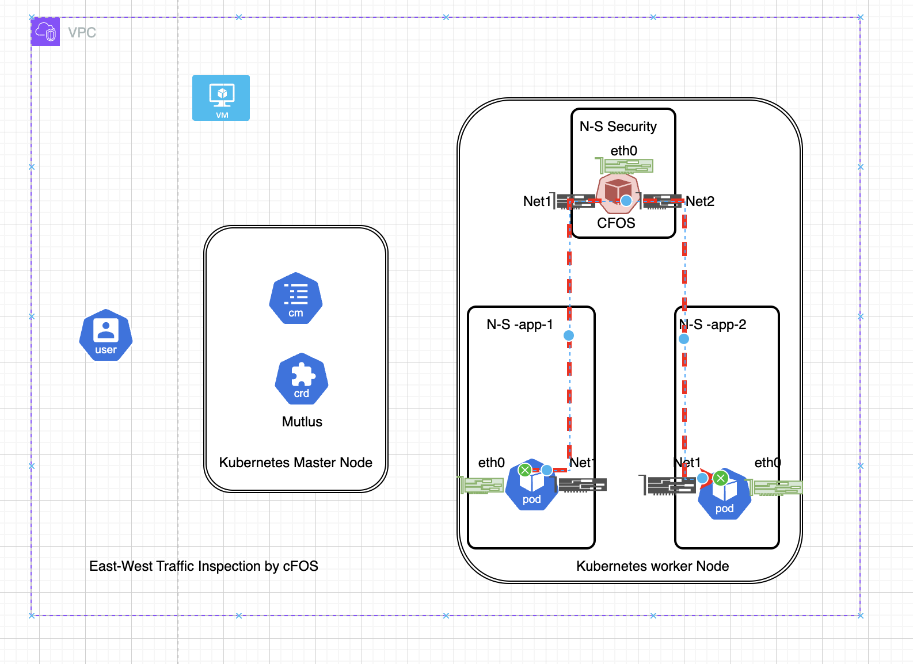

East-West traffic in the context of container-based environments, particularly with Kubernetes, refers to the data flow between different nodes or pods within the same data center or network. This type of traffic is crucial for the performance and security of microservices architectures, where multiple services need to communicate with each other frequently.

Microservices break down applications into smaller, independent services, which increases the amount of East-West traffic. Each service might be running in different containers that need to communicate with each other.




{}
continue from previous Task [Egress with cFOS](/09egresstraffic/task9_1_understanding_egress_rules.html#purpose)
- create firewall policy for east-west traffic 


The firewall policy allow traffic from net1 to net2 inspected by firewall policy

```bash
cat << EOF  | tee > net1net2cmfirewallpolicy.yaml
apiVersion: v1
kind: ConfigMap
metadata:
  name: net1net2
  labels:
      app: fos
      category: config
data:
  type: partial
  config: |-
    config firewall policy
      edit 10
        set utm-status enable
        set srcintf "net1"
        set dstintf "net2"
        set srcaddr "all"
        set dstaddr "all"
        set service "ALL"
        set ssl-ssh-profile "deep-inspection"
        set av-profile "default"
        set webfilter-profile "default"
        set ips-sensor "high_security"
        set logtraffic all
       next
    end
    config firewall policy
      edit 11
        set utm-status enable
        set srcintf "net2"
        set dstintf "net1"
        set srcaddr "all"
        set dstaddr "all"
        set service "ALL"
        set ssl-ssh-profile "deep-inspection"
        set av-profile "default"
        set webfilter-profile "default"
        set ips-sensor "high_security"
        set logtraffic all
       next
    end
EOF
kubectl apply -f net1net2cmfirewallpolicy.yaml  -n cfosegress
```
{}
{}

- get ip from diag100 and diag200

```bash
diag200ip=$(k get po/diag200 -n app-1 -o jsonpath='{.metadata.annotations}' | jq -r '.["k8s.v1.cni.cncf.io/network-status"]' | jq -r '.[0].ips[0]')
echo $diag200ip
diag100ip=$(k get po/diag100 -n app-2 -o jsonpath='{.metadata.annotations}' | jq -r '.["k8s.v1.cni.cncf.io/network-status"]' | jq -r '.[0].ips[0]')
echo $diag100ip

```
{}
{}

- check connectivity between diag100 to diag200
```bash
k exec -it po/diag100 -n app-2 -- ping -c 5  $diag200ip
k exec -it po/diag200 -n app-1 -- ping -c 5 $diag100ip
```
{}
{}
- Send malicious traffic

```bash
k exec -it po/diag100 -n app-2 -- curl --max-time 5 -H "User-Agent: () { :; }; /bin/ls" http://$diag200ip
k exec -it po/diag200 -n app-1 -- curl --max-time 5 -H "User-Agent: () { :; }; /bin/ls" http://$diag100ip


```
{}
{}

- Check Result

```bash
podname=$(kubectl get pod -n cfosegress -l app=cfos -o jsonpath='{.items[*].metadata.name}')
kubectl exec -it po/$podname -n cfosegress -- tail -f /data/var/log/log/ips.0


```
expected output

```
kubectl exec -it po/$podname -n cfosegress -- tail -f /data/var/log/log/ips.0
Defaulted container "cfos7210250-container" out of: cfos7210250-container, init-myservice (init)
date=2024-06-27 time=09:18:00 eventtime=1719479880 tz="+0000" logid="0419016384" type="utm" subtype="ips" eventtype="signature" level="alert" severity="critical" srcip=10.1.200.22 dstip=34.117.186.192 srcintf="net1" dstintf="eth0" sessionid=2 action="dropped" proto=6 service="HTTP" policyid=100 attack="Bash.Function.Definitions.Remote.Code.Execution" srcport=33352 dstport=80 hostname="ipinfo.io" url="/" direction="outgoing" attackid=39294 profile="high_security" incidentserialno=265289730 msg="applications3: Bash.Function.Definitions.Remote.Code.Execution"
date=2024-06-27 time=09:37:35 eventtime=1719481055 tz="+0000" logid="0419016384" type="utm" subtype="ips" eventtype="signature" level="alert" severity="critical" srcip=10.1.100.22 dstip=10.1.200.22 srcintf="net2" dstintf="net1" sessionid=10 action="dropped" proto=6 service="HTTP" policyid=11 attack="Bash.Function.Definitions.Remote.Code.Execution" srcport=46952 dstport=80 hostname="10.1.200.22" url="/" direction="outgoing" attackid=39294 profile="high_security" incidentserialno=265289733 msg="applications3: Bash.Function.Definitions.Remote.Code.Execution"
date=2024-06-27 time=09:37:41 eventtime=1719481061 tz="+0000" logid="0419016384" type="utm" subtype="ips" eventtype="signature" level="alert" severity="critical" srcip=10.1.200.22 dstip=10.1.100.22 srcintf="net1" dstintf="net2" sessionid=11 action="dropped" proto=6 service="HTTP" policyid=10 attack="Bash.Function.Definitions.Remote.Code.Execution" srcport=40358 dstport=80 hostname="10.1.100.22" url="/" direction="outgoing" attackid=39294 profile="high_security" incidentserialno=265289734 msg="applications3: Bash.Function.Definitions.Remote.Code.Execution"
```

{}
{}


- clean up

```bash
kubectl delete namespace app-1
kubectl delete namespace app-2
kubectl delete namespace cfosegress
```

- delete all resource

```bash

rg=$(az group list --query "[?contains(name, '$(whoami)') && contains(name, 'workshop')].name" -o tsv)
vmNames=$(az vm list -g $rg --query "[].name" -o tsv)
for vmName in $vmNames; do 
   az vm delete --name $vmName -g $rg --yes
done

diskNames=$(az disk list --resource-group "$rg" --query "[].name" -o tsv)
  for diskName in $diskNames; do
    az disk delete --name "$diskName" --resource-group $rg --yes
  done

nics=$(az network nic list -g $rg -o tsv)
for nic in $nics; do
    az network nic delete --name $nic -g $rg
done

publicIps=$(az network public-ip list -g $rg -o tsv)
for publicIp in $publicIps; do 
    az network public-ip delete --name $publicIp -g $rg
done

vnets=$(az network vnet list -g $rg -o tsv)
for vnet in $vnets; do
   az network vnet delete --name $vnet -g $rg
done


nsgs=$(az network nsg list -g $rg -o tsv) 
for nsg in $nsgs; do
    az network nsg delete --name $nsg -g $rg 
done


az aks delete -n $(whoami)-aks-cluster -g $rg
```
{}


Q&A

1. Use ConfigMap to change firewall policy to stop icmp traffic between app1 and app2, meanwhile still allow http/https traffic betwen app1 and app2 with security inspection. 


